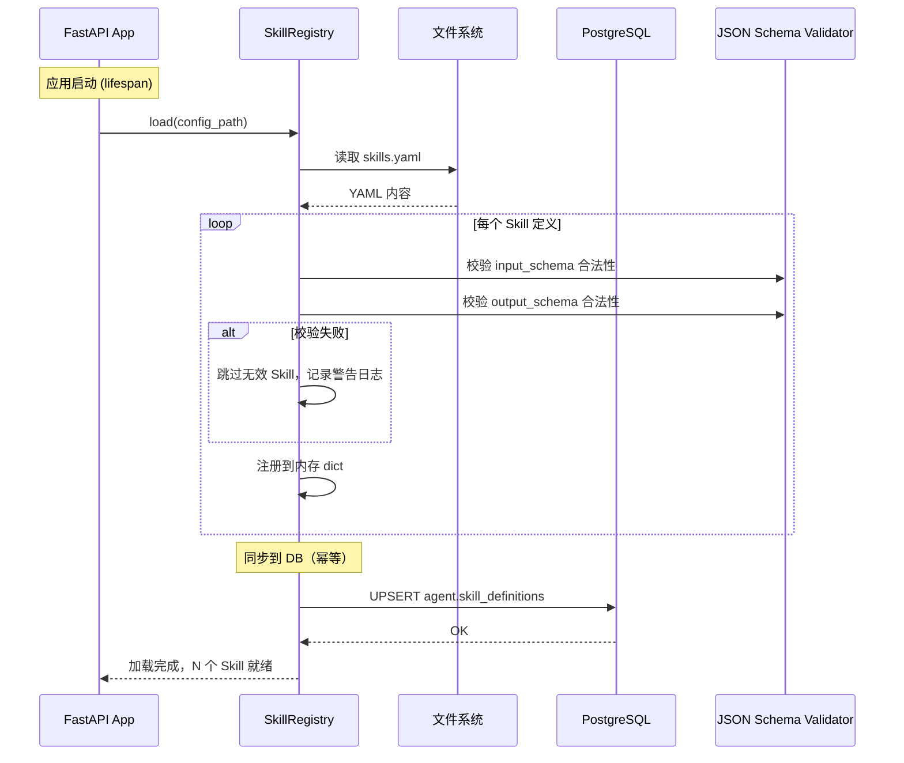

# Agent 服务设计

> **文档版本**：v1.0
> **作者**：赵一凡（架构师）
> **适用范围**：agent-service 服务，包含 Principal 中间件集成、SkillRegistry、精简 Agent Loop、审计日志
> **里程碑**：M2（W0 + 3 周，Phase 2.5 完成）

---

## 1. 服务概述

### 1.1 职责定义

agent-service 是 Prism 平台的 Agent 运行时服务，负责：

1. **Principal 统一身份集成**：消费 shared 提供的 PrincipalMiddleware，所有 API 端点统一识别 Human（JWT）和 Agent（API Key）身份
2. **SkillRegistry**：YAML 配置驱动的 Skill 注册表，定义 Agent 可调用的能力，预留 Phase 3 后迁移 DB 的路径
3. **精简 Agent Loop**：ReAct 循环引擎，硬编码迭代上限，token 计数，单次执行完成一个分析任务
4. **AgentExecutionLog**：审计日志持久化，记录每次 Agent 执行的完整轨迹

### 1.2 PRD 功能映射

| PRD 功能 | Agent 服务对应组件 | 优先级 | 工时 |
|----------|------------------|--------|------|
| F7: Principal 抽象 | PrincipalMiddleware 集成 + Principal 注入 | Must Have (Type 1 决策) | 3 人天（含 shared 侧） |
| F8: YAML SkillRegistry + Protocol 接口 | `core/skill_registry.py` + `configs/skills.yaml` | Must Have | 2 人天 |
| F9: 精简 Agent Loop | `core/agent_loop.py` + `core/react_engine.py` | Must Have | 6.5 人天 |

### 1.3 设计约束

| 约束 | 来源 | 说明 |
|------|------|------|
| Type 1 决策：Principal 抽象 | R1 辩论 c | 一旦确定不可逆，Day 1 必须做对 |
| Type 2 决策：SkillRegistry YAML | R1 辩论 c | 可逆决策，先简后补，Phase 3 后迁移 DB |
| Type 2 决策：硬编码 Loop 参数 | R1 辩论 c | 可逆决策，Phase 3 后配置化 |
| 两层结构 | 开发原则 | api/ + core/，400 行上限触发拆分讨论 |
| Schema 隔离 | F10 | 使用独立 `agent` schema |
| 陈思琪否决权 | R4 | Phase 3 后 2 周内必须执行 Agent 还债(S2)，否则 block Phase 4 |

### 1.4 里程碑

| 里程碑 | 时间 | 交付物 | 验收标准 |
|--------|------|--------|---------|
| **M2** | W0 + 3 周 | Principal 集成 + SkillRegistry + Agent Loop + 审计日志 | Agent 完成一次 ReAct 循环 + 审计日志生成 |

### 1.5 不做的事（Phase 2.5 精简版边界）

| 不做 | 推迟到 | 理由 |
|------|--------|------|
| SkillRegistry 迁移 DB | S2（Phase 3 后强制） | Type 2 决策，先简后补 |
| Agent Loop 配置化 | S2（Phase 3 后强制） | Type 2 决策 |
| Agent 对话界面 | W3（Phase 5） | 前端复杂度过高 |
| 多 Agent 协作 | Phase 5 | 超出精简版范围 |
| 异步任务队列 | Phase 4+ | Phase 2.5 同步执行足够 |

---

## 2. 模块结构

### 2.1 目录树

```
agent-service/
├── pyproject.toml
├── alembic.ini
├── alembic/
│   ├── env.py
│   └── versions/
├── configs/
│   └── skills.yaml                # Skill 定义（YAML 配置）
└── src/
    └── agent_service/
        ├── __init__.py
        ├── main.py                 # FastAPI app 入口
        ├── config.py               # AgentSettings（继承 BaseAppSettings）
        ├── api/                    # API 层（安全边界）
        │   ├── __init__.py
        │   ├── routers/
        │   │   ├── __init__.py
        │   │   ├── health.py       # GET /health
        │   │   ├── skills.py       # GET /api/agent/skills
        │   │   ├── execute.py      # POST /api/agent/execute
        │   │   └── executions.py   # GET /api/agent/executions/{id}
        │   ├── schemas/
        │   │   ├── __init__.py
        │   │   ├── skill.py        # SkillResponse, SkillListResponse
        │   │   ├── execute.py      # ExecuteRequest, ExecuteResponse
        │   │   └── execution.py    # ExecutionLogResponse
        │   └── deps.py             # FastAPI 依赖（DB session, Principal）
        ├── core/                   # 核心逻辑
        │   ├── __init__.py
        │   ├── skill_registry.py   # YAML SkillRegistry
        │   ├── skill_protocol.py   # Skill Protocol 接口
        │   ├── agent_loop.py       # 精简 Agent Loop（ReAct 引擎）
        │   ├── llm_client.py       # 调用 llm-service 的 HTTP 客户端
        │   └── token_counter.py    # Token 计数器
        ├── models/                 # SQLAlchemy ORM 模型
        │   ├── __init__.py
        │   ├── skill_definition.py # SkillDefinition 模型
        │   └── execution_log.py    # ExecutionLog 模型
        └── services/               # 业务逻辑层
            ├── __init__.py
            ├── skill_service.py    # Skill 查询逻辑
            ├── execution_service.py # 执行与日志逻辑
            └── audit_service.py    # 审计日志持久化
```

### 2.2 模块职责

| 模块 | 职责 | 行数预估 |
|------|------|---------|
| `api/routers/skills.py` | Skill 列表 API | ~40 行 |
| `api/routers/execute.py` | Agent 执行 API（参数校验、调用 core） | ~80 行 |
| `api/routers/executions.py` | 执行日志查询 API | ~50 行 |
| `api/schemas/` | 请求/响应 Pydantic 模型 | ~120 行 |
| `core/skill_registry.py` | YAML 加载、Skill 查找、Protocol 校验 | ~150 行 |
| `core/skill_protocol.py` | Skill 抽象协议 + 内置 Skill 基类 | ~100 行 |
| `core/agent_loop.py` | ReAct 循环引擎（核心） | ~250 行 |
| `core/llm_client.py` | 调用 llm-service /api/llm/chat | ~80 行 |
| `core/token_counter.py` | Token 计数和预算管理 | ~60 行 |
| `models/` | ORM 模型定义 | ~80 行 |
| `services/` | 业务逻辑 | ~150 行 |

### 2.3 依赖关系

```
agent-service 的依赖：
├── prism_shared              # DB session, Principal, JWT, 通用模型, 异常
├── httpx                     # 调用 llm-service HTTP API
├── pyyaml                    # 加载 skills.yaml
├── tiktoken                  # Token 计数（与 LLM tokenizer 对齐）
├── fastapi
├── sqlalchemy[asyncio]
├── pydantic / pydantic-settings
└── structlog

agent-service 不得依赖：
├── llm_service              # 仅通过 HTTP API 调用
├── user_service             # 仅通过 shared.auth 消费认证结果
└── voc_service              # 仅通过 HTTP API 调用（Phase 3+）
```

---

## 3. 数据模型

### 3.1 DDL（agent Schema）

```sql
-- 创建 agent schema
CREATE SCHEMA IF NOT EXISTS agent;

-- ==========================================================
-- agent.skill_definitions
-- 用途：Skill 定义的持久化存储（Phase 2.5 由 YAML 同步入库，
--       Phase 3 后迁移为 DB 主数据源）
-- ==========================================================
CREATE TABLE agent.skill_definitions (
    id UUID PRIMARY KEY DEFAULT gen_random_uuid(),
    name VARCHAR(100) UNIQUE NOT NULL,
    description TEXT,
    input_schema JSONB NOT NULL,
    output_schema JSONB NOT NULL,
    cost_metadata JSONB DEFAULT '{}',
    is_enabled BOOLEAN DEFAULT true,
    created_at TIMESTAMPTZ DEFAULT now()
);

COMMENT ON TABLE agent.skill_definitions IS 'Skill 定义表。Phase 2.5 由 YAML 同步入库，Phase 3+ 迁移为 DB 主数据源。';
COMMENT ON COLUMN agent.skill_definitions.name IS 'Skill 唯一标识名，如 voc_search、data_import';
COMMENT ON COLUMN agent.skill_definitions.input_schema IS 'JSON Schema 格式的输入参数定义';
COMMENT ON COLUMN agent.skill_definitions.output_schema IS 'JSON Schema 格式的输出格式定义';
COMMENT ON COLUMN agent.skill_definitions.cost_metadata IS '成本元信息：预估 token、耗时、调用频率限制等';

-- ==========================================================
-- agent.execution_logs
-- 用途：Agent 执行审计日志，记录每次 Skill 调用的完整信息
-- ==========================================================
CREATE TABLE agent.execution_logs (
    id UUID PRIMARY KEY DEFAULT gen_random_uuid(),
    -- 身份信息
    principal_id VARCHAR(200) NOT NULL,
    principal_type VARCHAR(20) NOT NULL CHECK (principal_type IN ('human', 'agent')),
    -- 执行信息
    session_id UUID NOT NULL,
    skill_name VARCHAR(100) NOT NULL,
    iteration_index INTEGER NOT NULL DEFAULT 0,
    input_params JSONB,
    output_result JSONB,
    -- 资源消耗
    token_usage INTEGER DEFAULT 0,
    duration_ms INTEGER,
    -- 执行结果
    status VARCHAR(20) NOT NULL CHECK (status IN ('success', 'failed', 'terminated', 'timeout')),
    error_message TEXT,
    -- 时间
    created_at TIMESTAMPTZ DEFAULT now()
);

COMMENT ON TABLE agent.execution_logs IS 'Agent 执行审计日志。每次 Skill 调用生成一条记录。';
COMMENT ON COLUMN agent.execution_logs.session_id IS '同一次 Agent 执行的所有迭代共享同一个 session_id';
COMMENT ON COLUMN agent.execution_logs.iteration_index IS 'ReAct 循环中的迭代序号（从 0 开始）';
COMMENT ON COLUMN agent.execution_logs.status IS 'terminated: 达到迭代上限; timeout: 单次迭代超时';

-- 索引
CREATE INDEX idx_execution_logs_principal
    ON agent.execution_logs(principal_id, created_at DESC);

CREATE INDEX idx_execution_logs_skill
    ON agent.execution_logs(skill_name, created_at DESC);

CREATE INDEX idx_execution_logs_session
    ON agent.execution_logs(session_id, iteration_index);

CREATE INDEX idx_execution_logs_status
    ON agent.execution_logs(status, created_at DESC);
```

### 3.2 ORM 模型

```python
# agent-service/src/agent_service/models/skill_definition.py

import uuid
from datetime import datetime

from sqlalchemy import Boolean, DateTime, String, Text, func
from sqlalchemy.dialects.postgresql import JSONB, UUID
from sqlalchemy.orm import Mapped, mapped_column

from prism_shared.db.base import Base


class SkillDefinition(Base):
    """Skill 定义 ORM 模型。"""

    __tablename__ = "skill_definitions"
    __table_args__ = {"schema": "agent"}

    id: Mapped[uuid.UUID] = mapped_column(
        UUID(as_uuid=True), primary_key=True, default=uuid.uuid4,
        server_default=func.gen_random_uuid(),
    )
    name: Mapped[str] = mapped_column(String(100), unique=True, nullable=False)
    description: Mapped[str | None] = mapped_column(Text)
    input_schema: Mapped[dict] = mapped_column(JSONB, nullable=False)
    output_schema: Mapped[dict] = mapped_column(JSONB, nullable=False)
    cost_metadata: Mapped[dict] = mapped_column(JSONB, default=dict, server_default="{}")
    is_enabled: Mapped[bool] = mapped_column(Boolean, default=True)
    created_at: Mapped[datetime] = mapped_column(
        DateTime(timezone=True), server_default=func.now(),
    )
```

```python
# agent-service/src/agent_service/models/execution_log.py

import uuid
from datetime import datetime

from sqlalchemy import DateTime, Integer, String, Text, func, CheckConstraint
from sqlalchemy.dialects.postgresql import JSONB, UUID
from sqlalchemy.orm import Mapped, mapped_column

from prism_shared.db.base import Base


class ExecutionLog(Base):
    """Agent 执行审计日志 ORM 模型。"""

    __tablename__ = "execution_logs"
    __table_args__ = (
        CheckConstraint(
            "principal_type IN ('human', 'agent')",
            name="ck_execution_logs_principal_type",
        ),
        CheckConstraint(
            "status IN ('success', 'failed', 'terminated', 'timeout')",
            name="ck_execution_logs_status",
        ),
        {"schema": "agent"},
    )

    id: Mapped[uuid.UUID] = mapped_column(
        UUID(as_uuid=True), primary_key=True, default=uuid.uuid4,
        server_default=func.gen_random_uuid(),
    )
    principal_id: Mapped[str] = mapped_column(String(200), nullable=False)
    principal_type: Mapped[str] = mapped_column(String(20), nullable=False)
    session_id: Mapped[uuid.UUID] = mapped_column(UUID(as_uuid=True), nullable=False)
    skill_name: Mapped[str] = mapped_column(String(100), nullable=False)
    iteration_index: Mapped[int] = mapped_column(Integer, default=0)
    input_params: Mapped[dict | None] = mapped_column(JSONB)
    output_result: Mapped[dict | None] = mapped_column(JSONB)
    token_usage: Mapped[int] = mapped_column(Integer, default=0)
    duration_ms: Mapped[int | None] = mapped_column(Integer)
    status: Mapped[str] = mapped_column(String(20), nullable=False)
    error_message: Mapped[str | None] = mapped_column(Text)
    created_at: Mapped[datetime] = mapped_column(
        DateTime(timezone=True), server_default=func.now(),
    )
```

### 3.3 索引策略

| 索引 | 列 | 用途 |
|------|---|------|
| `idx_execution_logs_principal` | `(principal_id, created_at DESC)` | 按身份查询执行历史 |
| `idx_execution_logs_skill` | `(skill_name, created_at DESC)` | 按 Skill 查询调用统计 |
| `idx_execution_logs_session` | `(session_id, iteration_index)` | 查询单次执行的完整迭代链 |
| `idx_execution_logs_status` | `(status, created_at DESC)` | 按状态筛选（如查找失败记录） |

### 3.4 ER 图描述

```
agent schema
├── agent.skill_definitions
│   ├── id (PK, UUID)
│   ├── name (UNIQUE)
│   ├── description
│   ├── input_schema (JSONB)
│   ├── output_schema (JSONB)
│   ├── cost_metadata (JSONB)
│   ├── is_enabled
│   └── created_at
│
└── agent.execution_logs
    ├── id (PK, UUID)
    ├── principal_id           ← 逻辑引用 auth.users.id 或 auth.api_keys.id
    ├── principal_type         ← 'human' | 'agent'
    ├── session_id             ← 同一次 Agent 执行的唯一标识
    ├── skill_name             ← 逻辑引用 skill_definitions.name
    ├── iteration_index
    ├── input_params (JSONB)
    ├── output_result (JSONB)
    ├── token_usage
    ├── duration_ms
    ├── status
    ├── error_message
    └── created_at

注意：execution_logs 与 skill_definitions 之间不建外键约束。
原因：YAML SkillRegistry 是权威数据源（Phase 2.5），DB 中的 skill_definitions
     仅为查询优化的冗余副本。skill_name 通过应用层校验一致性。
```

---

## 4. API 设计

### 4.1 端点总览

| 方法 | 路径 | 说明 | 认证要求 |
|------|------|------|---------|
| GET | `/health` | 健康检查 | 无 |
| GET | `/api/agent/skills` | 可用 Skill 列表 | Bearer / API Key |
| POST | `/api/agent/execute` | 执行 Agent 任务 | Bearer / API Key |
| GET | `/api/agent/executions/{id}` | 查询执行日志 | Bearer / API Key |

### 4.2 GET /api/agent/skills

**请求**：无参数

**响应 200**：
```json
{
  "data": [
    {
      "name": "voc_search",
      "description": "在 VOC 数据中进行语义搜索",
      "input_schema": {
        "type": "object",
        "required": ["query"],
        "properties": {
          "query": {"type": "string", "description": "搜索查询文本"},
          "top_k": {"type": "integer", "default": 5, "description": "返回结果数量"}
        }
      },
      "output_schema": {
        "type": "object",
        "properties": {
          "results": {
            "type": "array",
            "items": {
              "type": "object",
              "properties": {
                "text": {"type": "string"},
                "score": {"type": "number"},
                "tags": {"type": "array", "items": {"type": "string"}}
              }
            }
          }
        }
      },
      "cost_metadata": {
        "estimated_tokens": 500,
        "estimated_duration_ms": 2000
      },
      "is_enabled": true
    }
  ],
  "meta": {
    "request_id": "550e8400-e29b-41d4-a716-446655440000",
    "timestamp": "2026-02-12T10:00:00Z"
  }
}
```

### 4.3 POST /api/agent/execute

**请求**：
```json
{
  "task": "分析最近一周用户关于支付体验的反馈，找出关键问题",
  "context": {
    "data_source": "all",
    "time_range": "7d"
  },
  "options": {
    "max_iterations": 5,
    "timeout_seconds": 300
  }
}
```

**响应 200（成功）**：
```json
{
  "data": {
    "session_id": "a1b2c3d4-e5f6-7890-abcd-ef1234567890",
    "status": "completed",
    "iterations": 3,
    "total_token_usage": 4520,
    "total_duration_ms": 12350,
    "result": {
      "summary": "用户支付体验的主要问题集中在三个方面...",
      "findings": [
        {
          "issue": "支付页面加载缓慢",
          "evidence_count": 15,
          "sentiment_avg": -0.72,
          "tags": ["支付卡顿", "页面加载慢"]
        }
      ],
      "skill_calls": [
        {
          "skill": "voc_search",
          "iteration": 0,
          "input": {"query": "支付体验"},
          "status": "success",
          "duration_ms": 1850
        },
        {
          "skill": "voc_search",
          "iteration": 1,
          "input": {"query": "支付卡顿 转圈"},
          "status": "success",
          "duration_ms": 1620
        }
      ]
    }
  },
  "meta": {
    "request_id": "660e8400-e29b-41d4-a716-446655440001",
    "timestamp": "2026-02-12T10:00:12Z"
  }
}
```

**响应 200（达到迭代上限）**：
```json
{
  "data": {
    "session_id": "b2c3d4e5-f6a7-8901-bcde-f12345678901",
    "status": "terminated",
    "iterations": 10,
    "total_token_usage": 8192,
    "total_duration_ms": 58000,
    "result": {
      "summary": "分析未在限定迭代内完成，以下是已收集的部分结果...",
      "partial": true,
      "findings": []
    }
  },
  "meta": { "..." }
}
```

**错误响应**：

| HTTP 状态码 | 错误码 | 场景 |
|------------|--------|------|
| 400 | `AGENT_INVALID_TASK` | 任务描述为空或不合法 |
| 401 | `SHARED_UNAUTHORIZED` | 未认证 |
| 404 | `AGENT_SKILL_NOT_FOUND` | 引用了不存在的 Skill |
| 408 | `AGENT_EXECUTION_TIMEOUT` | 总执行超时 |
| 422 | `AGENT_VALIDATION_ERROR` | 请求参数校验失败 |
| 500 | `AGENT_LOOP_ERROR` | Agent Loop 内部错误 |
| 503 | `AGENT_LLM_UNAVAILABLE` | llm-service 不可用 |

### 4.4 GET /api/agent/executions/{id}

**请求**：URL 参数 `id` = session_id (UUID)

**响应 200**：
```json
{
  "data": {
    "session_id": "a1b2c3d4-e5f6-7890-abcd-ef1234567890",
    "principal_id": "user-123",
    "principal_type": "human",
    "status": "completed",
    "iterations": [
      {
        "index": 0,
        "skill_name": "voc_search",
        "input_params": {"query": "支付体验"},
        "output_result": {"results": ["..."]},
        "token_usage": 1500,
        "duration_ms": 1850,
        "status": "success",
        "created_at": "2026-02-12T10:00:01Z"
      },
      {
        "index": 1,
        "skill_name": "voc_search",
        "input_params": {"query": "支付卡顿 转圈"},
        "output_result": {"results": ["..."]},
        "token_usage": 1200,
        "duration_ms": 1620,
        "status": "success",
        "created_at": "2026-02-12T10:00:04Z"
      }
    ],
    "total_token_usage": 4520,
    "total_duration_ms": 12350,
    "created_at": "2026-02-12T10:00:00Z"
  },
  "meta": { "..." }
}
```

---

## 5. 核心流程

### 5.1 Agent 执行主流程

```mermaid
sequenceDiagram
    participant Client
    participant API as ExecuteRouter
    participant Principal as Principal 中间件
    participant Loop as AgentLoop
    participant LLM as LLM Client
    participant Registry as SkillRegistry
    participant Skill as Skill 实例
    participant Audit as AuditService
    participant DB as PostgreSQL

    Client->>API: POST /api/agent/execute {task}
    API->>Principal: get_principal()
    Principal-->>API: Principal{type, id}
    API->>API: 校验请求参数

    API->>Loop: execute(task, principal, options)
    Loop->>Loop: 生成 session_id
    Loop->>Loop: 初始化 token_budget, iteration=0

    loop ReAct 循环 (max 10 次)
        Loop->>Loop: 检查迭代上限 / token 预算 / 超时
        alt 达到终止条件
            Loop->>Audit: log(session_id, status=terminated)
            Audit->>DB: INSERT execution_log
            Loop-->>API: TerminatedResult
        end

        Note over Loop: Reasoning 阶段
        Loop->>LLM: POST /api/llm/chat (slot=reasoning)
        Note over LLM: System prompt + 任务描述 +<br/>可用 Skill 列表 + 历史上下文
        LLM-->>Loop: LLM Response{action, params}
        Loop->>Loop: 累加 token_usage

        alt LLM 决定 "finish"
            Loop->>Audit: log(session_id, status=success)
            Audit->>DB: INSERT execution_log
            Loop-->>API: CompletedResult
        end

        Note over Loop: Action 阶段
        Loop->>Registry: get_skill(action.skill_name)
        Registry-->>Loop: SkillInstance
        Loop->>Skill: execute(params)
        Skill-->>Loop: SkillResult

        Loop->>Audit: log(session_id, skill_name, status, duration)
        Audit->>DB: INSERT execution_log
        Loop->>Loop: 将 SkillResult 加入上下文
        Loop->>Loop: iteration++
    end

    API-->>Client: 200 ApiResponse{ExecuteResult}
```

### 5.2 Skill 调用详细流程

```mermaid
sequenceDiagram
    participant Loop as AgentLoop
    participant Registry as SkillRegistry
    participant Protocol as SkillProtocol
    participant Skill as 具体 Skill
    participant External as 外部服务

    Loop->>Registry: get_skill("voc_search")
    Registry->>Registry: 查找 YAML 定义
    Registry->>Registry: 检查 is_enabled
    Registry-->>Loop: SkillDefinition + handler

    Loop->>Protocol: validate_input(params, input_schema)
    alt 校验失败
        Protocol-->>Loop: ValidationError
        Loop->>Loop: 记录错误，继续下一轮
    end

    Loop->>Skill: execute(validated_params)
    Note over Skill: 内部可能调用外部服务<br/>(如 voc-service API)
    Skill->>External: HTTP API 调用
    External-->>Skill: 响应
    Skill-->>Loop: SkillOutput

    Loop->>Protocol: validate_output(output, output_schema)
    Loop->>Loop: 将输出加入 ReAct 上下文
```

### 5.3 Token 预算管理流程

```mermaid
sequenceDiagram
    participant Loop as AgentLoop
    participant Counter as TokenCounter
    participant LLM as LLM Client

    Note over Loop: 初始化
    Loop->>Counter: init(max_tokens=8192)

    loop 每次迭代
        Loop->>Counter: estimate_prompt_tokens(context)
        Counter-->>Loop: estimated_tokens

        alt 预估超出预算
            Loop->>Loop: 截断历史上下文（保留最近 3 轮）
            Loop->>Counter: estimate_prompt_tokens(truncated_context)
            Counter-->>Loop: new_estimated_tokens
        end

        Loop->>LLM: chat(messages, max_tokens=remaining_budget)
        LLM-->>Loop: response + usage{prompt_tokens, completion_tokens}

        Loop->>Counter: consume(usage.total_tokens)
        Counter-->>Loop: remaining_budget

        alt 剩余预算 < 最小阈值(500)
            Loop->>Loop: 强制进入 finish 阶段
        end
    end
```

### 5.4 YAML SkillRegistry 加载流程



---

## 6. 关键实现

### 6.1 Skill Protocol 接口

```python
# agent-service/src/agent_service/core/skill_protocol.py

from dataclasses import dataclass, field
from typing import Any, Protocol, runtime_checkable


@dataclass(frozen=True)
class SkillDefinition:
    """Skill 定义数据类。"""
    name: str
    description: str
    input_schema: dict[str, Any]
    output_schema: dict[str, Any]
    cost_metadata: dict[str, Any] = field(default_factory=dict)
    is_enabled: bool = True


@dataclass
class SkillResult:
    """Skill 执行结果。"""
    success: bool
    data: dict[str, Any] | None = None
    error: str | None = None
    token_usage: int = 0
    duration_ms: int = 0


@runtime_checkable
class SkillExecutor(Protocol):
    """
    Skill 执行器 Protocol。
    所有 Skill 实现必须满足此接口。
    Phase 3 后迁移 DB 时，接口不变。
    """

    async def execute(
        self, params: dict[str, Any], context: dict[str, Any] | None = None
    ) -> SkillResult:
        """执行 Skill。params 已通过 input_schema 校验。"""
        ...
```

### 6.2 YAML SkillRegistry

```python
# agent-service/src/agent_service/core/skill_registry.py

from pathlib import Path
from typing import Any

import structlog
import yaml
from jsonschema import Draft7Validator, SchemaError

from agent_service.core.skill_protocol import SkillDefinition, SkillExecutor

logger = structlog.get_logger(__name__)


class SkillRegistry:
    """
    YAML 配置驱动的 Skill 注册表。

    Phase 2.5: YAML 是权威数据源，启动时加载到内存 + 同步到 DB。
    Phase 3+（S2 还债）: 迁移为 DB 主数据源，YAML 仅作为 seed。
    """

    def __init__(self) -> None:
        self._definitions: dict[str, SkillDefinition] = {}
        self._executors: dict[str, SkillExecutor] = {}

    def load_from_yaml(self, config_path: str | Path) -> int:
        """
        从 YAML 文件加载 Skill 定义。
        返回成功加载的 Skill 数量。
        """
        path = Path(config_path)
        if not path.exists():
            logger.error("skill_config_not_found", path=str(path))
            return 0

        with open(path, "r", encoding="utf-8") as f:
            raw = yaml.safe_load(f)

        skills = raw.get("skills", [])
        loaded = 0

        for skill_data in skills:
            try:
                definition = self._parse_skill(skill_data)
                if definition.is_enabled:
                    self._definitions[definition.name] = definition
                    loaded += 1
                    logger.info("skill_loaded", name=definition.name)
            except (SchemaError, KeyError, ValueError) as e:
                logger.warning(
                    "skill_load_failed",
                    name=skill_data.get("name", "unknown"),
                    error=str(e),
                )

        logger.info("skill_registry_loaded", total=loaded, skipped=len(skills) - loaded)
        return loaded

    def register_executor(self, skill_name: str, executor: SkillExecutor) -> None:
        """注册 Skill 执行器。executor 必须满足 SkillExecutor Protocol。"""
        if skill_name not in self._definitions:
            raise ValueError(f"Skill '{skill_name}' 未在 YAML 中定义")
        if not isinstance(executor, SkillExecutor):
            raise TypeError(f"executor 必须实现 SkillExecutor Protocol")
        self._executors[skill_name] = executor
        logger.info("skill_executor_registered", name=skill_name)

    def get_definition(self, skill_name: str) -> SkillDefinition | None:
        """获取 Skill 定义。"""
        return self._definitions.get(skill_name)

    def get_executor(self, skill_name: str) -> SkillExecutor | None:
        """获取 Skill 执行器。"""
        return self._executors.get(skill_name)

    def list_available_skills(self) -> list[SkillDefinition]:
        """列出所有已启用且有执行器的 Skill。"""
        return [
            defn for name, defn in self._definitions.items()
            if name in self._executors and defn.is_enabled
        ]

    def list_all_definitions(self) -> list[SkillDefinition]:
        """列出所有 Skill 定义（包括无执行器的）。"""
        return list(self._definitions.values())

    def _parse_skill(self, data: dict[str, Any]) -> SkillDefinition:
        """解析单个 Skill 定义。"""
        name = data["name"]
        input_schema = data["input_schema"]
        output_schema = data["output_schema"]

        # 校验 JSON Schema 合法性
        Draft7Validator.check_schema(input_schema)
        Draft7Validator.check_schema(output_schema)

        return SkillDefinition(
            name=name,
            description=data.get("description", ""),
            input_schema=input_schema,
            output_schema=output_schema,
            cost_metadata=data.get("cost_metadata", {}),
            is_enabled=data.get("is_enabled", True),
        )
```

### 6.3 YAML 配置示例

```yaml
# agent-service/configs/skills.yaml

skills:
  - name: voc_search
    description: "在 VOC 数据中进行语义搜索，返回与查询语义相关的反馈片段"
    input_schema:
      type: object
      required: [query]
      properties:
        query:
          type: string
          description: "自然语言搜索查询"
        top_k:
          type: integer
          default: 5
          minimum: 1
          maximum: 20
          description: "返回结果数量"
        filters:
          type: object
          properties:
            source:
              type: string
              description: "数据源过滤"
            time_range:
              type: string
              enum: ["1d", "7d", "30d", "all"]
              description: "时间范围"
    output_schema:
      type: object
      properties:
        results:
          type: array
          items:
            type: object
            properties:
              text: { type: string }
              score: { type: number }
              tags: { type: array, items: { type: string } }
              source: { type: string }
    cost_metadata:
      estimated_tokens: 500
      estimated_duration_ms: 2000
      rate_limit_per_minute: 30
    is_enabled: true

  - name: tag_list
    description: "获取涌现标签列表，按使用频率排序"
    input_schema:
      type: object
      properties:
        limit:
          type: integer
          default: 20
          minimum: 1
          maximum: 100
        tag_type:
          type: string
          enum: ["all", "emergent", "preset"]
          default: "all"
    output_schema:
      type: object
      properties:
        tags:
          type: array
          items:
            type: object
            properties:
              name: { type: string }
              usage_count: { type: integer }
              tag_type: { type: string }
    cost_metadata:
      estimated_tokens: 200
      estimated_duration_ms: 500
    is_enabled: true

  - name: data_import
    description: "触发数据导入任务（CSV/JSON）"
    input_schema:
      type: object
      required: [source_id]
      properties:
        source_id:
          type: string
          format: uuid
          description: "数据源 ID"
        file_path:
          type: string
          description: "文件路径（服务器端）"
    output_schema:
      type: object
      properties:
        job_id: { type: string }
        status: { type: string }
        total_count: { type: integer }
    cost_metadata:
      estimated_tokens: 0
      estimated_duration_ms: 5000
    is_enabled: true
```

### 6.4 精简 Agent Loop（核心）

```python
# agent-service/src/agent_service/core/agent_loop.py

import time
import uuid
from dataclasses import dataclass, field
from typing import Any

import structlog

from agent_service.core.llm_client import LLMClient
from agent_service.core.skill_protocol import SkillDefinition, SkillResult
from agent_service.core.skill_registry import SkillRegistry
from agent_service.core.token_counter import TokenCounter

logger = structlog.get_logger(__name__)

# =============================================
# 硬编码参数（Phase 3 后配置化 → S2 还债）
# =============================================
MAX_ITERATIONS = 10               # 最大迭代次数
MAX_TOKENS_PER_SESSION = 8192     # 单次执行 token 上限
ITERATION_TIMEOUT_SECONDS = 60    # 单次迭代超时
MIN_TOKEN_THRESHOLD = 500         # 低于此值强制终止


@dataclass
class LoopContext:
    """Agent Loop 运行上下文。"""
    session_id: uuid.UUID = field(default_factory=uuid.uuid4)
    task: str = ""
    iteration: int = 0
    token_usage: int = 0
    history: list[dict[str, Any]] = field(default_factory=list)
    skill_calls: list[dict[str, Any]] = field(default_factory=list)


@dataclass
class LoopResult:
    """Agent Loop 执行结果。"""
    session_id: uuid.UUID
    status: str                  # "completed" | "terminated" | "timeout" | "failed"
    iterations: int
    total_token_usage: int
    total_duration_ms: int
    result: dict[str, Any] | None = None
    error: str | None = None


class AgentLoop:
    """
    精简版 ReAct Agent Loop。

    核心循环：
    1. Reasoning: 调用 LLM（reasoning 槽位）决定下一步行动
    2. Action: 执行选中的 Skill
    3. Observation: 将 Skill 结果加入上下文
    4. 重复，直到 LLM 决定 "finish" 或达到终止条件

    终止条件（任一满足即终止）：
    - LLM 输出 action = "finish"
    - 迭代次数 >= MAX_ITERATIONS
    - Token 累计消耗 >= MAX_TOKENS_PER_SESSION
    - 单次迭代超时 >= ITERATION_TIMEOUT_SECONDS
    """

    def __init__(
        self,
        llm_client: LLMClient,
        skill_registry: SkillRegistry,
    ) -> None:
        self._llm = llm_client
        self._registry = skill_registry
        self._token_counter = TokenCounter(budget=MAX_TOKENS_PER_SESSION)

    async def execute(
        self,
        task: str,
        principal_id: str,
        principal_type: str,
        options: dict[str, Any] | None = None,
    ) -> LoopResult:
        """执行 Agent 任务。"""
        ctx = LoopContext(task=task)
        start_time = time.monotonic()

        logger.info(
            "agent_loop_start",
            session_id=str(ctx.session_id),
            task=task[:200],
            principal_id=principal_id,
        )

        try:
            while ctx.iteration < MAX_ITERATIONS:
                iteration_start = time.monotonic()

                # 检查 token 预算
                if self._token_counter.remaining < MIN_TOKEN_THRESHOLD:
                    logger.info("agent_loop_token_exhausted", session_id=str(ctx.session_id))
                    return self._build_result(ctx, "terminated", start_time)

                # ---- Reasoning 阶段 ----
                reasoning_response = await self._reasoning_step(ctx)
                if reasoning_response is None:
                    return self._build_result(ctx, "failed", start_time, error="LLM 调用失败")

                # 累加 token
                usage = reasoning_response.get("token_usage", 0)
                ctx.token_usage += usage
                self._token_counter.consume(usage)

                # 解析 LLM 决策
                action = reasoning_response.get("action", {})
                action_type = action.get("type", "finish")

                # LLM 决定完成
                if action_type == "finish":
                    logger.info("agent_loop_finished", session_id=str(ctx.session_id), iterations=ctx.iteration)
                    return self._build_result(
                        ctx, "completed", start_time,
                        result=action.get("result"),
                    )

                # ---- Action 阶段 ----
                skill_name = action.get("skill", "")
                skill_params = action.get("params", {})

                skill_result = await self._action_step(ctx, skill_name, skill_params)

                # 记录 Skill 调用
                iteration_duration = int((time.monotonic() - iteration_start) * 1000)
                ctx.skill_calls.append({
                    "skill": skill_name,
                    "iteration": ctx.iteration,
                    "input": skill_params,
                    "status": "success" if skill_result.success else "failed",
                    "duration_ms": iteration_duration,
                })

                # ---- Observation 阶段 ----
                ctx.history.append({
                    "iteration": ctx.iteration,
                    "action": {"skill": skill_name, "params": skill_params},
                    "observation": skill_result.data if skill_result.success else {"error": skill_result.error},
                })

                ctx.iteration += 1

                # 检查单次迭代超时
                if (time.monotonic() - iteration_start) > ITERATION_TIMEOUT_SECONDS:
                    logger.warning("agent_loop_iteration_timeout", session_id=str(ctx.session_id))
                    return self._build_result(ctx, "timeout", start_time)

            # 达到最大迭代次数
            logger.info("agent_loop_max_iterations", session_id=str(ctx.session_id))
            return self._build_result(ctx, "terminated", start_time)

        except Exception as e:
            logger.exception("agent_loop_error", session_id=str(ctx.session_id))
            return self._build_result(ctx, "failed", start_time, error=str(e))

    async def _reasoning_step(self, ctx: LoopContext) -> dict[str, Any] | None:
        """Reasoning 阶段：调用 LLM 决定下一步行动。"""
        available_skills = self._registry.list_available_skills()
        system_prompt = self._build_system_prompt(available_skills)
        user_message = self._build_user_message(ctx)

        messages = [
            {"role": "system", "content": system_prompt},
            {"role": "user", "content": user_message},
        ]

        try:
            response = await self._llm.chat(
                messages=messages,
                slot="reasoning",
                max_tokens=min(2048, self._token_counter.remaining),
                response_format={"type": "json_object"},
            )
            return response
        except Exception as e:
            logger.error("reasoning_step_failed", error=str(e))
            return None

    async def _action_step(
        self, ctx: LoopContext, skill_name: str, params: dict[str, Any]
    ) -> SkillResult:
        """Action 阶段：执行指定 Skill。"""
        executor = self._registry.get_executor(skill_name)
        if executor is None:
            logger.warning("skill_not_found", skill_name=skill_name)
            return SkillResult(
                success=False,
                error=f"Skill '{skill_name}' 不存在或未注册执行器",
            )

        try:
            return await executor.execute(params, context={"session_id": str(ctx.session_id)})
        except Exception as e:
            logger.error("skill_execution_failed", skill_name=skill_name, error=str(e))
            return SkillResult(success=False, error=str(e))

    def _build_system_prompt(self, skills: list[SkillDefinition]) -> str:
        """构建 ReAct 系统 Prompt。"""
        skill_descriptions = "\n".join([
            f"- **{s.name}**: {s.description}\n"
            f"  输入参数: {s.input_schema}\n"
            f"  预估耗时: {s.cost_metadata.get('estimated_duration_ms', 'unknown')}ms"
            for s in skills
        ])

        return f"""你是一个数据分析 Agent。你的任务是帮助用户分析 VOC（客户声音）数据。

你可以使用以下工具（Skills）：
{skill_descriptions}

你必须以 JSON 格式回复，格式如下：

当你需要调用工具时：
{{"thought": "你的思考过程", "action": {{"type": "skill_call", "skill": "skill_name", "params": {{...}}}}}}

当你完成分析时：
{{"thought": "总结思考", "action": {{"type": "finish", "result": {{"summary": "分析总结", "findings": [...]}}}}}}

规则：
1. 每次只能调用一个工具
2. 根据工具返回的结果决定下一步操作
3. 如果工具调用失败，尝试调整参数重试或换用其他工具
4. 在收集到足够信息后尽快完成分析，不要做多余的工具调用"""

    def _build_user_message(self, ctx: LoopContext) -> str:
        """构建包含历史上下文的用户消息。"""
        parts = [f"任务: {ctx.task}"]

        if ctx.history:
            parts.append("\n历史执行记录:")
            # 保留最近 5 轮历史（防止 token 溢出）
            recent = ctx.history[-5:]
            for h in recent:
                parts.append(f"\n--- 第 {h['iteration']} 轮 ---")
                parts.append(f"行动: 调用 {h['action']['skill']}({h['action']['params']})")
                parts.append(f"结果: {h['observation']}")

        parts.append(f"\n当前是第 {ctx.iteration} 轮，请决定下一步操作。")
        return "\n".join(parts)

    def _build_result(
        self,
        ctx: LoopContext,
        status: str,
        start_time: float,
        result: dict[str, Any] | None = None,
        error: str | None = None,
    ) -> LoopResult:
        """构建执行结果。"""
        total_duration = int((time.monotonic() - start_time) * 1000)
        return LoopResult(
            session_id=ctx.session_id,
            status=status,
            iterations=ctx.iteration,
            total_token_usage=ctx.token_usage,
            total_duration_ms=total_duration,
            result={
                **(result or {}),
                "skill_calls": ctx.skill_calls,
                "partial": status != "completed",
            },
            error=error,
        )
```

### 6.5 LLM 客户端

```python
# agent-service/src/agent_service/core/llm_client.py

from typing import Any

import httpx
import structlog

logger = structlog.get_logger(__name__)


class LLMClient:
    """
    调用 llm-service 的 HTTP 客户端。
    通过 slot 参数指定使用的模型槽位。
    """

    def __init__(
        self,
        base_url: str = "http://localhost:8601",
        timeout: float = 60.0,
        api_key: str | None = None,
    ) -> None:
        self._base_url = base_url.rstrip("/")
        self._timeout = timeout
        self._api_key = api_key
        self._client: httpx.AsyncClient | None = None

    async def _get_client(self) -> httpx.AsyncClient:
        if self._client is None:
            headers = {}
            if self._api_key:
                headers["X-API-Key"] = self._api_key
            self._client = httpx.AsyncClient(
                base_url=self._base_url,
                timeout=self._timeout,
                headers=headers,
            )
        return self._client

    async def close(self) -> None:
        if self._client:
            await self._client.aclose()
            self._client = None

    async def chat(
        self,
        messages: list[dict[str, str]],
        slot: str = "reasoning",
        max_tokens: int = 2048,
        temperature: float = 0.3,
        response_format: dict[str, str] | None = None,
    ) -> dict[str, Any]:
        """
        调用 llm-service Chat API。

        Args:
            messages: 消息列表
            slot: 模型槽位 (fast | reasoning)
            max_tokens: 最大生成 token 数
            temperature: 生成温度
            response_format: 响应格式约束（如 {"type": "json_object"}）

        Returns:
            包含 action 和 token_usage 的字典

        Raises:
            httpx.HTTPStatusError: LLM 服务返回错误
        """
        client = await self._get_client()

        payload: dict[str, Any] = {
            "slot": slot,
            "messages": messages,
            "max_tokens": max_tokens,
            "temperature": temperature,
            "stream": False,
        }
        if response_format:
            payload["response_format"] = response_format

        try:
            response = await client.post("/api/llm/chat", json=payload)
            response.raise_for_status()
            data = response.json()

            # 解析 llm-service 响应
            llm_data = data.get("data", {})
            content = llm_data.get("choices", [{}])[0].get("message", {}).get("content", "{}")
            usage = llm_data.get("usage", {})

            # 解析 JSON 内容（ReAct 格式）
            import json
            parsed = json.loads(content)

            return {
                "action": parsed.get("action", {"type": "finish"}),
                "thought": parsed.get("thought", ""),
                "token_usage": usage.get("total_tokens", 0),
            }

        except httpx.HTTPStatusError as e:
            logger.error("llm_call_failed", status_code=e.response.status_code)
            raise
        except json.JSONDecodeError as e:
            logger.error("llm_response_parse_failed", content=content[:200])
            # 降级处理：LLM 返回非 JSON，视为 finish
            return {
                "action": {"type": "finish", "result": {"summary": content}},
                "thought": "LLM 返回非结构化内容",
                "token_usage": usage.get("total_tokens", 0),
            }
```

### 6.6 Token 计数器

```python
# agent-service/src/agent_service/core/token_counter.py

import structlog

logger = structlog.get_logger(__name__)


class TokenCounter:
    """
    Token 预算管理器。
    Phase 2.5: 基于 LLM 返回的 usage 累计。
    Phase 3+: 可选接入 tiktoken 做客户端预估。
    """

    def __init__(self, budget: int = 8192) -> None:
        self._budget = budget
        self._consumed = 0

    @property
    def budget(self) -> int:
        return self._budget

    @property
    def consumed(self) -> int:
        return self._consumed

    @property
    def remaining(self) -> int:
        return max(0, self._budget - self._consumed)

    def consume(self, tokens: int) -> int:
        """消耗 token，返回剩余预算。"""
        self._consumed += tokens
        remaining = self.remaining
        if remaining <= 0:
            logger.warning("token_budget_exhausted", consumed=self._consumed, budget=self._budget)
        return remaining

    def reset(self) -> None:
        """重置计数器。"""
        self._consumed = 0

    def estimate_prompt_tokens(self, text: str) -> int:
        """
        粗略估算文本的 token 数。
        规则：中文约 1.5 字符/token，英文约 4 字符/token。
        Phase 3+ 可替换为 tiktoken 精确计算。
        """
        # 简单启发式：按平均 2 字符/token 估算（中英文混合场景）
        return max(1, len(text) // 2)
```

### 6.7 API 路由实现

```python
# agent-service/src/agent_service/api/routers/execute.py

from typing import Any
from uuid import UUID

import structlog
from fastapi import APIRouter, Depends

from prism_shared.auth.principal import Principal, get_principal
from prism_shared.schemas.response import ApiResponse

from agent_service.api.schemas.execute import ExecuteRequest, ExecuteResponse
from agent_service.core.agent_loop import AgentLoop
from agent_service.services.execution_service import ExecutionService

logger = structlog.get_logger(__name__)
router = APIRouter(prefix="/api/agent", tags=["agent"])


@router.post("/execute", response_model=ApiResponse[ExecuteResponse])
async def execute_agent_task(
    request: ExecuteRequest,
    principal: Principal = Depends(get_principal),
    agent_loop: AgentLoop = Depends(),         # 通过 FastAPI DI 注入
    execution_service: ExecutionService = Depends(),
) -> ApiResponse[ExecuteResponse]:
    """
    执行 Agent 任务。

    Agent 将基于 ReAct 循环：
    1. 理解任务意图
    2. 选择合适的 Skill 执行
    3. 根据结果决定下一步
    4. 直到完成或达到迭代上限
    """
    result = await agent_loop.execute(
        task=request.task,
        principal_id=principal.id,
        principal_type=principal.type,
        options=request.options,
    )

    # 持久化审计日志
    await execution_service.save_execution_logs(
        session_id=result.session_id,
        principal_id=principal.id,
        principal_type=principal.type,
        skill_calls=result.result.get("skill_calls", []) if result.result else [],
        status=result.status,
        total_token_usage=result.total_token_usage,
        total_duration_ms=result.total_duration_ms,
    )

    return ApiResponse(data=ExecuteResponse(
        session_id=result.session_id,
        status=result.status,
        iterations=result.iterations,
        total_token_usage=result.total_token_usage,
        total_duration_ms=result.total_duration_ms,
        result=result.result,
    ))
```

### 6.8 Pydantic 请求/响应 Schema

```python
# agent-service/src/agent_service/api/schemas/execute.py

from typing import Any
from uuid import UUID

from pydantic import BaseModel, Field


class ExecuteOptions(BaseModel):
    """执行选项（覆盖默认参数）。"""
    max_iterations: int | None = Field(
        default=None,
        ge=1,
        le=10,
        description="最大迭代次数（上限 10）",
    )
    timeout_seconds: int | None = Field(
        default=None,
        ge=10,
        le=600,
        description="总执行超时（秒）",
    )


class ExecuteRequest(BaseModel):
    """Agent 执行请求。"""
    task: str = Field(
        ...,
        min_length=1,
        max_length=2000,
        description="任务描述（自然语言）",
    )
    context: dict[str, Any] | None = Field(
        default=None,
        description="任务上下文（数据源、时间范围等）",
    )
    options: dict[str, Any] | None = Field(
        default=None,
        description="执行选项",
    )


class SkillCallRecord(BaseModel):
    """Skill 调用记录。"""
    skill: str
    iteration: int
    input: dict[str, Any]
    status: str
    duration_ms: int


class ExecuteResponse(BaseModel):
    """Agent 执行响应。"""
    session_id: UUID
    status: str = Field(description="completed | terminated | timeout | failed")
    iterations: int
    total_token_usage: int
    total_duration_ms: int
    result: dict[str, Any] | None = None
```

```python
# agent-service/src/agent_service/api/schemas/skill.py

from typing import Any
from pydantic import BaseModel


class SkillResponse(BaseModel):
    """单个 Skill 信息。"""
    name: str
    description: str
    input_schema: dict[str, Any]
    output_schema: dict[str, Any]
    cost_metadata: dict[str, Any]
    is_enabled: bool
```

```python
# agent-service/src/agent_service/api/schemas/execution.py

from datetime import datetime
from typing import Any
from uuid import UUID

from pydantic import BaseModel


class IterationRecord(BaseModel):
    """单次迭代记录。"""
    index: int
    skill_name: str
    input_params: dict[str, Any] | None
    output_result: dict[str, Any] | None
    token_usage: int
    duration_ms: int | None
    status: str
    created_at: datetime


class ExecutionDetailResponse(BaseModel):
    """执行日志详情。"""
    session_id: UUID
    principal_id: str
    principal_type: str
    status: str
    iterations: list[IterationRecord]
    total_token_usage: int
    total_duration_ms: int
    created_at: datetime
```

### 6.9 FastAPI 应用入口

```python
# agent-service/src/agent_service/main.py

from contextlib import asynccontextmanager

import structlog
from fastapi import FastAPI

from prism_shared.auth.principal import PrincipalMiddleware
from prism_shared.db.session import create_engine, create_session_factory
from prism_shared.logging import configure_logging
from prism_shared.middleware.audit import AuditMiddleware
from prism_shared.middleware.request_id import RequestIdMiddleware

from agent_service.api.routers import execute, executions, health, skills
from agent_service.config import AgentSettings
from agent_service.core.skill_registry import SkillRegistry

logger = structlog.get_logger(__name__)


@asynccontextmanager
async def lifespan(app: FastAPI):
    """应用生命周期管理。"""
    settings = AgentSettings()
    configure_logging(log_level=settings.log_level)

    # 初始化数据库
    engine = create_engine(settings.database_url)
    session_factory = create_session_factory(engine)
    app.state.session_factory = session_factory

    # 加载 SkillRegistry
    registry = SkillRegistry()
    loaded = registry.load_from_yaml(settings.skill_config_path)
    logger.info("skills_loaded", count=loaded)
    app.state.skill_registry = registry

    yield

    # 清理
    await engine.dispose()
    logger.info("agent_service_shutdown")


def create_app() -> FastAPI:
    app = FastAPI(
        title="Prism Agent Service",
        version="0.1.0",
        lifespan=lifespan,
    )

    # 中间件（注册顺序 = 执行逆序）
    settings = AgentSettings()
    app.add_middleware(AuditMiddleware)
    app.add_middleware(
        PrincipalMiddleware,
        jwt_secret=settings.jwt_secret,
    )
    app.add_middleware(RequestIdMiddleware)

    # 路由
    app.include_router(health.router)
    app.include_router(skills.router)
    app.include_router(execute.router)
    app.include_router(executions.router)

    return app


app = create_app()
```

---

## 7. 错误处理与弹性

### 7.1 异常分类

| 分类 | 错误码 | HTTP 状态码 | 处理策略 |
|------|--------|-----------|---------|
| 任务校验失败 | `AGENT_INVALID_TASK` | 400 | 直接返回参数错误 |
| Skill 不存在 | `AGENT_SKILL_NOT_FOUND` | 404 | 返回可用 Skill 列表提示 |
| Skill 执行失败 | `AGENT_SKILL_ERROR` | 内部处理 | 记录错误，通知 LLM 重新决策 |
| LLM 调用失败 | `AGENT_LLM_UNAVAILABLE` | 503 | 重试 1 次；仍失败则终止循环 |
| LLM 返回非法格式 | `AGENT_LLM_PARSE_ERROR` | 内部处理 | 降级为 finish，返回原始内容 |
| Token 预算耗尽 | `AGENT_TOKEN_EXHAUSTED` | 内部处理 | 终止循环，返回已收集结果 |
| 迭代超时 | `AGENT_EXECUTION_TIMEOUT` | 408 | 终止当前迭代，返回部分结果 |
| 达到迭代上限 | `AGENT_MAX_ITERATIONS` | 内部处理 | 终止循环，status=terminated |
| 内部错误 | `AGENT_LOOP_ERROR` | 500 | 日志记录完整堆栈 |

### 7.2 Skill 调用弹性策略

```python
# AgentLoop 中 Skill 调用的弹性处理

async def _action_step_with_resilience(
    self, ctx: LoopContext, skill_name: str, params: dict
) -> SkillResult:
    """带弹性策略的 Skill 调用。"""

    # 1. 校验 Skill 存在
    definition = self._registry.get_definition(skill_name)
    if definition is None:
        return SkillResult(
            success=False,
            error=f"Skill '{skill_name}' 不存在。可用 Skills: "
                  f"{[s.name for s in self._registry.list_available_skills()]}",
        )

    # 2. 校验输入参数
    try:
        from jsonschema import validate, ValidationError
        validate(instance=params, schema=definition.input_schema)
    except ValidationError as e:
        return SkillResult(
            success=False,
            error=f"参数校验失败: {e.message}",
        )

    # 3. 执行 Skill（带超时）
    import asyncio
    executor = self._registry.get_executor(skill_name)
    try:
        result = await asyncio.wait_for(
            executor.execute(params),
            timeout=ITERATION_TIMEOUT_SECONDS,
        )
        return result
    except asyncio.TimeoutError:
        return SkillResult(success=False, error=f"Skill '{skill_name}' 执行超时")
    except Exception as e:
        return SkillResult(success=False, error=f"Skill 执行异常: {str(e)}")
```

### 7.3 LLM 调用弹性策略

```python
# LLMClient 中的重试逻辑

async def chat_with_retry(
    self,
    messages: list[dict],
    slot: str = "reasoning",
    max_retries: int = 1,
    **kwargs,
) -> dict:
    """
    带重试的 LLM 调用。
    Phase 2.5: 最多重试 1 次（简单策略）。
    故障转移由 llm-service 的 SlotRouter 负责。
    """
    last_error = None
    for attempt in range(max_retries + 1):
        try:
            return await self.chat(messages=messages, slot=slot, **kwargs)
        except httpx.HTTPStatusError as e:
            last_error = e
            if e.response.status_code == 503:
                # llm-service 不可用，等待后重试
                logger.warning(
                    "llm_call_retry",
                    attempt=attempt,
                    status_code=e.response.status_code,
                )
                if attempt < max_retries:
                    import asyncio
                    await asyncio.sleep(2 ** attempt)  # 指数退避
                continue
            raise  # 非 503 错误不重试

    raise last_error  # 重试耗尽
```

### 7.4 错误传播策略

```
Client 请求 → PrincipalMiddleware（401 拦截）
                  ↓
            ExecuteRouter（400/422 参数校验）
                  ↓
            AgentLoop（内部错误隔离在循环内）
                  │
                  ├─ Reasoning 失败 → 重试 1 次 → 仍失败 → LoopResult(status=failed)
                  ├─ Skill 不存在 → 告知 LLM → LLM 换 Skill
                  ├─ Skill 执行失败 → 告知 LLM → LLM 决策重试或换 Skill
                  ├─ Token 耗尽 → LoopResult(status=terminated)
                  └─ 迭代超时 → LoopResult(status=timeout)
                  ↓
            ExecuteRouter 将 LoopResult 转为 ApiResponse
                  ↓
            Client 收到统一格式响应（200，data.status 区分结果）
```

关键原则：**Agent Loop 内部的错误不直接抛出 HTTP 异常，而是封装到 LoopResult 中**。调用方通过 `status` 字段判断执行结果。这确保了即使 Agent 执行失败，客户端也能获得结构化的错误信息和已收集的部分结果。

---

## 8. 测试计划

### 8.1 单元测试

| 模块 | 测试文件 | 测试范围 |
|------|---------|---------|
| `core/skill_registry.py` | `test_skill_registry.py` | YAML 加载、Skill 查找、无效配置处理 |
| `core/skill_protocol.py` | `test_skill_protocol.py` | Protocol 校验、SkillResult 构造 |
| `core/agent_loop.py` | `test_agent_loop.py` | 循环终止条件、token 预算、上下文构建 |
| `core/token_counter.py` | `test_token_counter.py` | 预算管理、边界值、估算精度 |
| `api/schemas/` | `test_schemas.py` | Pydantic 模型序列化/反序列化 |

```python
# agent-service/tests/unit/test_skill_registry.py

import pytest
import tempfile
import yaml
from pathlib import Path

from agent_service.core.skill_registry import SkillRegistry


@pytest.fixture
def valid_yaml(tmp_path):
    config = {
        "skills": [
            {
                "name": "test_skill",
                "description": "测试 Skill",
                "input_schema": {
                    "type": "object",
                    "required": ["query"],
                    "properties": {"query": {"type": "string"}},
                },
                "output_schema": {
                    "type": "object",
                    "properties": {"result": {"type": "string"}},
                },
                "cost_metadata": {"estimated_tokens": 100},
                "is_enabled": True,
            }
        ]
    }
    path = tmp_path / "skills.yaml"
    path.write_text(yaml.dump(config))
    return path


def test_load_valid_yaml(valid_yaml):
    registry = SkillRegistry()
    loaded = registry.load_from_yaml(valid_yaml)
    assert loaded == 1
    assert registry.get_definition("test_skill") is not None


def test_load_nonexistent_file():
    registry = SkillRegistry()
    loaded = registry.load_from_yaml("/nonexistent/path.yaml")
    assert loaded == 0


def test_disabled_skill_not_in_available(valid_yaml):
    registry = SkillRegistry()
    registry.load_from_yaml(valid_yaml)
    # 没有注册 executor 的 skill 不在 available 列表中
    assert len(registry.list_available_skills()) == 0
    assert len(registry.list_all_definitions()) == 1
```

```python
# agent-service/tests/unit/test_agent_loop.py

import pytest
from unittest.mock import AsyncMock, MagicMock

from agent_service.core.agent_loop import AgentLoop, MAX_ITERATIONS
from agent_service.core.skill_protocol import SkillResult


@pytest.fixture
def mock_llm_client():
    client = AsyncMock()
    # 模拟 LLM 第一次调用返回 skill_call，第二次返回 finish
    client.chat.side_effect = [
        {
            "action": {"type": "skill_call", "skill": "voc_search", "params": {"query": "test"}},
            "thought": "需要搜索数据",
            "token_usage": 500,
        },
        {
            "action": {"type": "finish", "result": {"summary": "分析完成"}},
            "thought": "数据已充分",
            "token_usage": 300,
        },
    ]
    return client


@pytest.fixture
def mock_registry():
    registry = MagicMock()
    executor = AsyncMock()
    executor.execute.return_value = SkillResult(
        success=True, data={"results": [{"text": "支付很慢"}]}, token_usage=0, duration_ms=100,
    )

    skill_def = MagicMock()
    skill_def.name = "voc_search"
    skill_def.description = "搜索"
    skill_def.input_schema = {"type": "object"}
    skill_def.cost_metadata = {}

    registry.list_available_skills.return_value = [skill_def]
    registry.get_executor.return_value = executor
    registry.get_definition.return_value = skill_def
    return registry


@pytest.mark.asyncio
async def test_successful_execution(mock_llm_client, mock_registry):
    loop = AgentLoop(llm_client=mock_llm_client, skill_registry=mock_registry)
    result = await loop.execute(
        task="分析支付问题",
        principal_id="user-1",
        principal_type="human",
    )
    assert result.status == "completed"
    assert result.iterations == 1  # 一次 skill_call + 一次 finish
    assert result.total_token_usage == 800


@pytest.mark.asyncio
async def test_max_iterations_termination(mock_registry):
    """测试达到最大迭代次数时终止。"""
    client = AsyncMock()
    # 每次都返回 skill_call，永不 finish
    client.chat.return_value = {
        "action": {"type": "skill_call", "skill": "voc_search", "params": {"query": "test"}},
        "thought": "继续搜索",
        "token_usage": 50,
    }

    loop = AgentLoop(llm_client=client, skill_registry=mock_registry)
    result = await loop.execute(
        task="无限任务",
        principal_id="user-1",
        principal_type="human",
    )
    assert result.status == "terminated"
    assert result.iterations == MAX_ITERATIONS
```

```python
# agent-service/tests/unit/test_token_counter.py

import pytest
from agent_service.core.token_counter import TokenCounter


def test_initial_state():
    counter = TokenCounter(budget=8192)
    assert counter.budget == 8192
    assert counter.consumed == 0
    assert counter.remaining == 8192


def test_consume_tokens():
    counter = TokenCounter(budget=1000)
    remaining = counter.consume(300)
    assert remaining == 700
    assert counter.consumed == 300


def test_budget_exhaustion():
    counter = TokenCounter(budget=100)
    counter.consume(90)
    assert counter.remaining == 10
    counter.consume(20)
    assert counter.remaining == 0  # 不会变为负数


def test_estimate_prompt_tokens():
    counter = TokenCounter()
    # 中英文混合文本
    text = "Hello 世界 test 测试"
    tokens = counter.estimate_prompt_tokens(text)
    assert tokens > 0
```

### 8.2 集成测试

| 场景 | 外部依赖 | 验证点 |
|------|---------|--------|
| 端到端 Agent 执行 | PostgreSQL + llm-service Mock | 完整 ReAct 循环 + 审计日志持久化 |
| SkillRegistry YAML 同步 DB | PostgreSQL | YAML 加载后 skill_definitions 表同步 |
| 执行日志查询 | PostgreSQL | 按 session_id 查询完整迭代链 |
| Principal 认证 | 无 | JWT / API Key 正确解析 |

```python
# agent-service/tests/integration/test_execution_flow.py

import pytest
from httpx import AsyncClient
from agent_service.main import app

from prism_shared.auth.jwt import create_access_token

TEST_SECRET = "test-secret"


@pytest.fixture
def auth_headers():
    token = create_access_token(
        data={"sub": "user-123", "username": "testuser"},
        secret=TEST_SECRET,
    )
    return {"Authorization": f"Bearer {token}"}


@pytest.mark.asyncio
async def test_execute_and_query_logs(auth_headers):
    """端到端测试：执行 Agent 任务 → 查询执行日志。"""
    async with AsyncClient(app=app, base_url="http://test") as client:
        # 执行任务
        response = await client.post(
            "/api/agent/execute",
            json={"task": "分析用户反馈"},
            headers=auth_headers,
        )
        assert response.status_code == 200
        data = response.json()["data"]
        session_id = data["session_id"]
        assert data["status"] in ("completed", "terminated", "failed")

        # 查询执行日志
        response = await client.get(
            f"/api/agent/executions/{session_id}",
            headers=auth_headers,
        )
        assert response.status_code == 200
        log_data = response.json()["data"]
        assert log_data["session_id"] == session_id
```

### 8.3 Mock 策略

| 外部依赖 | 单元测试 Mock | 集成测试 Mock |
|---------|-------------|-------------|
| llm-service | `AsyncMock`（预设 LLM 响应序列） | HTTP Mock Server（httpx_mock 或 respx） |
| PostgreSQL | 不使用（纯逻辑测试） | testcontainers 或 CI services |
| voc-service | Skill executor Mock | HTTP Mock Server |
| Redis | 不涉及 | 不涉及 |

---

## 9. 里程碑与工时

### 9.1 M2 任务拆解

| 任务 | 工时 | 依赖 | 交付物 |
|------|------|------|--------|
| T1: 项目脚手架 | 0.5 天 | shared M1 | pyproject.toml, main.py, health router, alembic 配置 |
| T2: ORM 模型 + DB 迁移 | 0.5 天 | T1 | models/, alembic/versions/001_initial.py |
| T3: API schemas | 0.5 天 | T1 | api/schemas/ |
| T4: Skill Protocol + SkillRegistry | 2 天 | T1 | core/skill_protocol.py, core/skill_registry.py, configs/skills.yaml |
| T5: LLM Client | 1 天 | T1 | core/llm_client.py |
| T6: Token Counter | 0.5 天 | T1 | core/token_counter.py |
| T7: Agent Loop（核心） | 3 天 | T4, T5, T6 | core/agent_loop.py |
| T8: API 路由 | 1 天 | T3, T7 | api/routers/ |
| T9: 审计日志持久化 | 0.5 天 | T2, T8 | services/audit_service.py, services/execution_service.py |
| T10: Principal 中间件集成 | 0.5 天 | shared M2 | main.py 中间件配置 |
| T11: 单元测试 | 1.5 天 | T4-T9 | tests/unit/ |
| T12: 集成测试 | 1 天 | T8-T10 | tests/integration/ |
| **M2 合计** | **12.5 天** | | |

注意：上述工时包含 shared 侧 Principal 中间件的 3 人天（在平台基础设施 M2 中），agent-service 侧仅负责集成配置（T10, 0.5 天）。实际 agent-service 独立工时约 **12 天**。

### 9.2 依赖图

```
shared M1 (DB, JWT, 异常)
    │
    └──→ T1 (脚手架) ──→ T2 (模型) ──→ T9 (审计)
         │                                  ↑
         ├──→ T3 (schemas)                  │
         │       └──→ T8 (路由) ────────────┤
         │                ↑                  │
         ├──→ T4 (Skill) ─┤                 │
         │                │                  │
         ├──→ T5 (LLM)  ──┤                 │
         │                │                  │
         └──→ T6 (Token) ─┴──→ T7 (Loop) ──┘
                                   ↑
                          shared M2 (Principal)
                                   │
                                   └──→ T10 (集成)

测试:
  T11 (单元测试) ← T4-T9
  T12 (集成测试) ← T8-T10
```

### 9.3 风险缓冲

| 风险 | 概率 | 影响 | 缓冲 |
|------|------|------|------|
| LLM ReAct 格式解析不稳定 | 中 | 高 | T7 预留降级处理（非 JSON 输出视为 finish） |
| Skill Protocol 设计不满足 Phase 3 需求 | 低 | 中 | Protocol 设计为最小接口，预留扩展字段 |
| llm-service 槽位 API 未就绪 | 低 | 高 | T5 可先 Mock llm-service 响应 |
| Agent 还债(S2)工时不足 | 中 | 高 | M2 的 Type 2 决策（YAML/硬编码）刻意降低实现复杂度 |

### 9.4 检查清单

**M2 验收**：
- [ ] `uv run ruff check agent-service/` 无错误
- [ ] `uv run ruff format --check agent-service/` 无差异
- [ ] `uv run pytest agent-service/tests/ -v` 全部通过
- [ ] `uv run lint-imports` agent-service 依赖方向检查通过
- [ ] SkillRegistry 从 YAML 加载至少 1 个 Skill
- [ ] Agent Loop 完成一次完整 ReAct 循环（Reasoning → Action → Observation → Finish）
- [ ] 审计日志写入 agent.execution_logs 表
- [ ] `GET /api/agent/skills` 返回可用 Skill 列表
- [ ] `POST /api/agent/execute` 返回结构化执行结果
- [ ] `GET /api/agent/executions/{session_id}` 返回完整迭代链
- [ ] Principal 中间件正确识别 Human（JWT）和 Agent（API Key）
- [ ] 达到迭代上限时 status=terminated 且返回部分结果
- [ ] Token 预算耗尽时正确终止
- [ ] LLM 返回非 JSON 时降级处理不崩溃
- [ ] 未认证请求返回 401

### 9.5 S2 还债预告（Phase 3 后强制）

以下工作在 M2 中**刻意不做**，标记为 Phase 3 后 S2 还债内容：

| 还债项 | 预估工时 | 当前降级方案 | 还债方案 |
|--------|---------|------------|---------|
| SkillRegistry 迁移 DB | 5-8 天 | YAML 文件作为权威数据源 | DB 主数据源 + CRUD API + 运行时动态注册 |
| Agent Loop 配置化 | 3-5 天 | MAX_ITERATIONS=10 等硬编码 | pydantic-settings 配置 + 按任务类型差异化 |
| Token 计数精确化 | 1 天 | len(text)//2 粗估 | 接入 tiktoken 精确计算 |
| Skill 输入校验前置 | 0.5 天 | Loop 内部校验 | API 层校验（fail fast） |

**强制约束**：陈思琪保留否决权——如果 M5 验收后 2 周内 S2 未启动，有权 block Phase 4 全部 Agent 相关功能。
