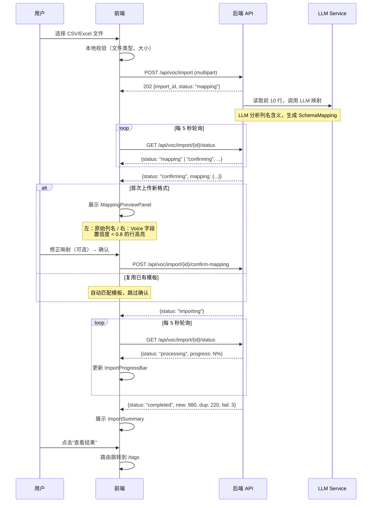
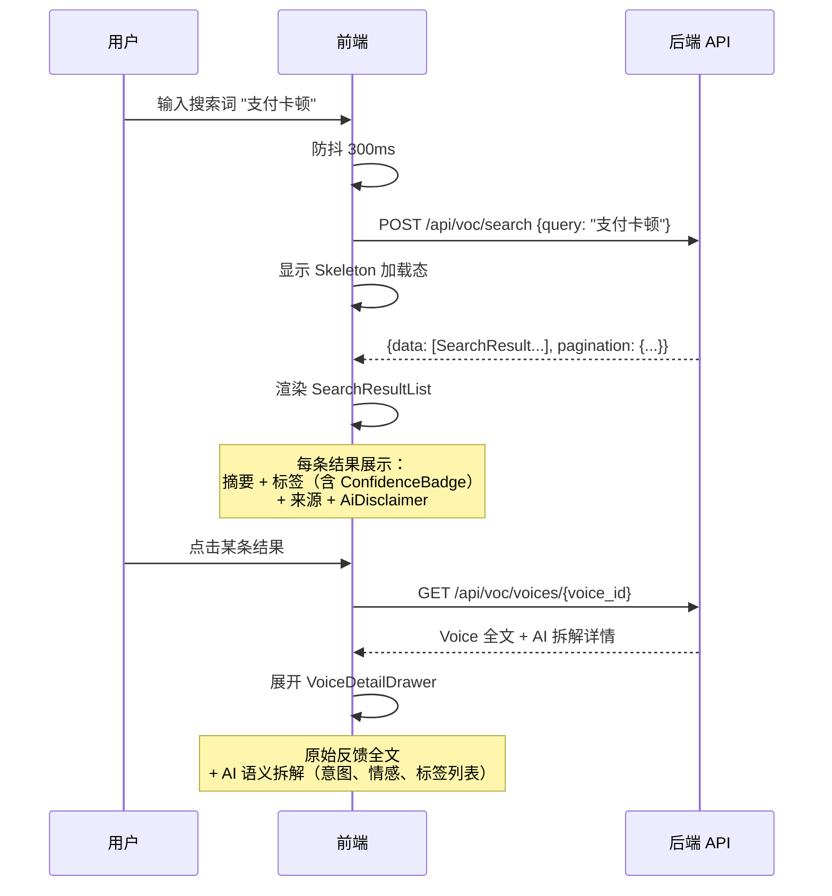
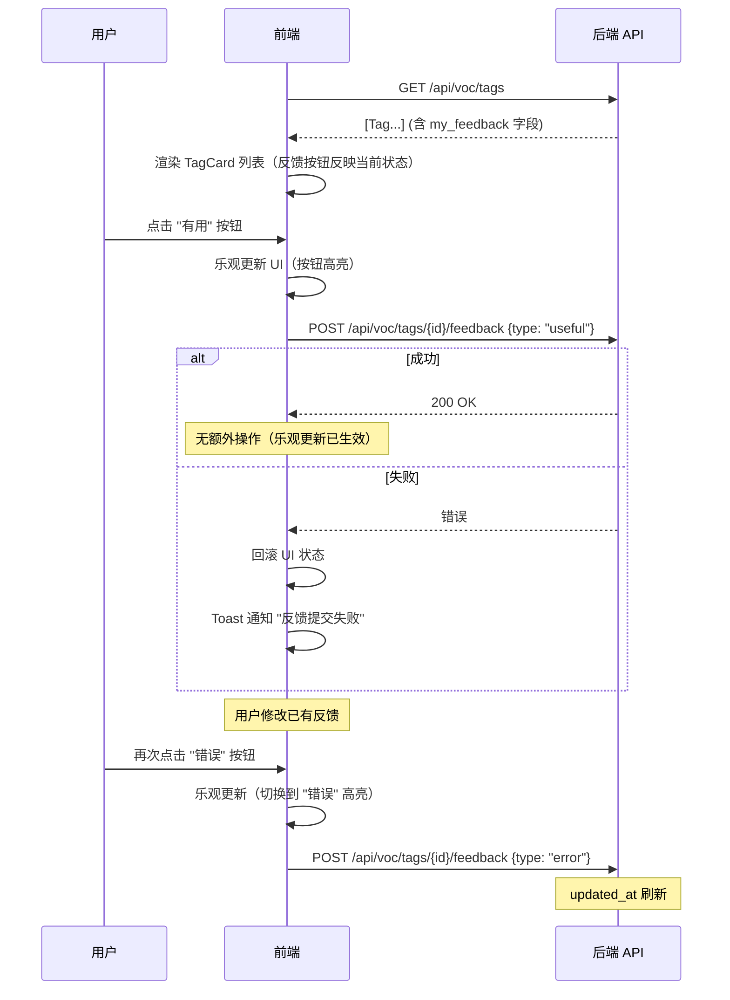
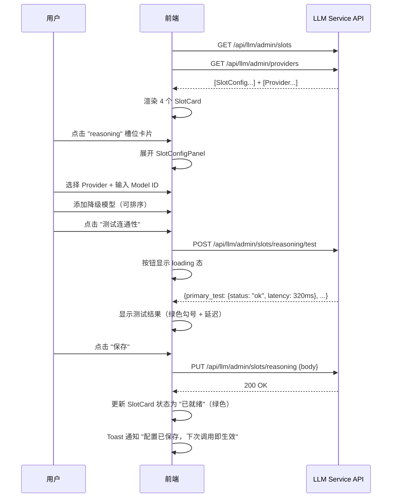
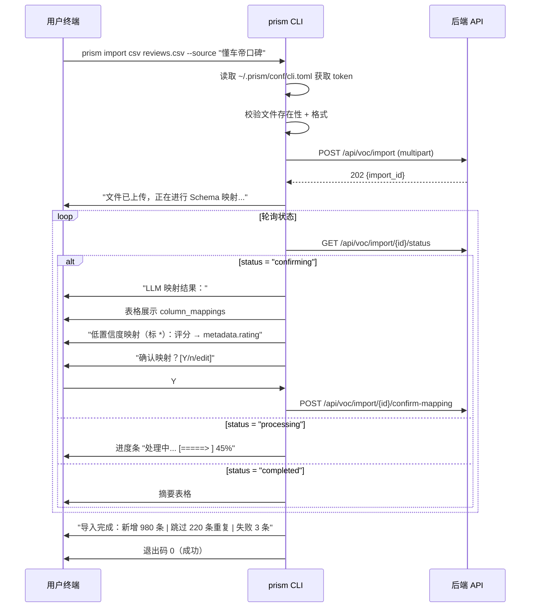

# 前端 & CLI 实现级设计文档

> 负责人：张晨曦（前端负责人）
> 版本：v1.0
> 基线：PRD v2.0 + R5-A/B/C 决议
> 适用范围：M5（Phase 3 前端 + 集成）+ M8（CLI 爬虫命令）

---

## 1. 服务概述

### 1.1 职责定义

前端（apps/web）是 Prism 平台面向产品经理等非技术用户的可视化交互层。CLI（apps/cli）是面向开发者和 AI Agent 的命令行工具。二者共享后端 API，但交互模式和输出格式不同。

**前端核心职责**：

| 职责 | 说明 |
|------|------|
| 数据导入页（F11） | CSV/Excel 上传 + LLM 映射预览 + 导入进度 + 摘要 |
| 语义搜索页（F12） | 自然语言搜索 + 结果列表 + 溯源展开 |
| 标签列表页（F13） | 涌现标签卡片 + 置信度三档 + 三元反馈按钮 |
| 槽位配置页（F21） | 4 槽位卡片 + Provider 选择 + 降级链 + 连通性测试 |
| LLM 映射确认 UI（F20） | 映射预览面板 + 置信度高亮 + 修正交互 |
| 对比视图（F15） | 涌现标签 vs 预设分类 + 偏好投票 |
| 反馈按钮（F14） | 有用/无用/错误三元反馈 |
| 置信度展示（F6） | 三档颜色编码（高=绿、中=黄、低=红）+ "AI 生成"标注 |
| LLM Studio: Playground（F27） | 三模式交互测试（Chat 流式对话 / Embedding 向量化+相似度 / Rerank 重排序） |
| LLM Studio: 槽位测试（F27） | 槽位调用测试 + 路由决策展示 + 故障转移时间线可视化 |

**CLI 核心职责**：

| 命令 | 说明 |
|------|------|
| `prism login` | JWT 认证 + Token 本地存储 |
| `prism import csv/excel <file>` | 数据导入（复用后端 API） |
| `prism search "query"` | 语义搜索 |
| `prism slot list/config/test` | 槽位管理 |
| `prism crawl dongchedi/weibo` | 爬虫触发（Wave 2，M8） |

### 1.2 PRD 功能映射

| PRD 功能 | 前端/CLI | 交付物 | 里程碑 |
|----------|----------|--------|--------|
| F11: 数据导入页 | 前端 | `/import` 页面 | M5 |
| F12: 语义搜索页 | 前端 | `/search` 页面 | M5 |
| F13: 标签列表页 | 前端 | `/tags` 页面 | M5 |
| F14: 反馈按钮 | 前端 | 三元反馈组件 | M5 |
| F15: 对比视图 | 前端 | `/tags/compare` 页面 | M5 |
| F20: 映射确认 UI | 前端 | 映射预览面板组件 | M5 |
| F21: 槽位配置页 | 前端 | `/admin/slots` 页面 | M5 |
| F6: 置信度三档 | 前端 | ConfidenceBadge 组件 | M5 |
| F1: 数据导入 | CLI | `prism import` 命令 | M5 |
| F4: 语义搜索 | CLI | `prism search` 命令 | M5 |
| F21: 槽位管理 | CLI | `prism slot` 命令组 | M5 |
| F22/F23: 爬虫 | CLI | `prism crawl` 命令 | M8 |
| F27: LLM Studio | 前端 | `/studio/playground` + `/studio/slots` 页面 | M5 |

### 1.3 里程碑

**M5（W0 + 12 周）**：Phase 3 前端 + 集成
- 5 个核心页面全部上线
- 对比视图可演示
- 端到端流程联调通过

**M8（W0 + 20-22 周）**：CLI 爬虫命令
- `prism crawl dongchedi/weibo` 可用
- 爬虫数据自动进入摄入管线

---

## 2. 模块结构

### 2.1 前端目录树

```
apps/web/
├── package.json
├── tsconfig.json                      # strict: true, 零 any
├── vite.config.ts
├── index.html
├── public/
│   └── favicon.svg
│
├── src/
│   ├── main.tsx                       # 应用入口
│   ├── App.tsx                        # 根组件 + 路由
│   ├── vite-env.d.ts
│   │
│   ├── api/                           # 全局 API 层
│   │   ├── client.ts                 # fetch 封装（拦截器、错误处理、Token 注入）
│   │   ├── types.ts                  # openapi-typescript 自动生成的类型
│   │   └── endpoints.ts             # API 端点常量
│   │
│   ├── components/                    # 全局通用组件
│   │   ├── ui/                       # shadcn/ui 组件（按需引入）
│   │   │   ├── button.tsx
│   │   │   ├── card.tsx
│   │   │   ├── input.tsx
│   │   │   ├── badge.tsx
│   │   │   ├── dialog.tsx
│   │   │   ├── select.tsx
│   │   │   ├── progress.tsx
│   │   │   ├── toast.tsx
│   │   │   ├── skeleton.tsx
│   │   │   └── ...
│   │   ├── Layout.tsx                # 主布局（侧边栏 + 顶栏 + 内容区）
│   │   ├── Sidebar.tsx               # 侧边栏导航
│   │   ├── ProtectedRoute.tsx        # 认证守卫
│   │   ├── ConfidenceBadge.tsx       # 置信度三档颜色徽章
│   │   ├── AiDisclaimer.tsx          # "AI 生成，仅供参考"标注
│   │   ├── ErrorBoundary.tsx         # 错误边界
│   │   └── LoadingSpinner.tsx
│   │
│   ├── stores/                        # Zustand 全局状态
│   │   └── auth-store.ts            # 认证状态（token、user、login/logout）
│   │
│   ├── hooks/                         # 全局通用 hooks
│   │   ├── use-api.ts               # SWR 封装 hook
│   │   └── use-toast.ts             # Toast 通知
│   │
│   ├── lib/                           # 工具函数
│   │   ├── utils.ts                  # cn()、格式化等
│   │   ├── confidence.ts            # 置信度分档逻辑
│   │   └── constants.ts             # 全局常量
│   │
│   ├── features/                      # 按功能域组织
│   │   │
│   │   ├── auth/                     # 认证功能域
│   │   │   ├── pages/
│   │   │   │   └── LoginPage.tsx
│   │   │   ├── components/
│   │   │   │   └── LoginForm.tsx
│   │   │   ├── hooks/
│   │   │   │   └── use-auth.ts
│   │   │   └── api/
│   │   │       └── auth-api.ts
│   │   │
│   │   ├── import/                   # 数据导入功能域
│   │   │   ├── pages/
│   │   │   │   └── ImportPage.tsx
│   │   │   ├── components/
│   │   │   │   ├── FileUploadZone.tsx         # 拖拽上传区
│   │   │   │   ├── MappingPreviewPanel.tsx     # LLM 映射预览面板（F20）
│   │   │   │   ├── MappingRow.tsx             # 单行映射（原始列名 → Voice 字段）
│   │   │   │   ├── ImportProgressBar.tsx      # 导入进度条
│   │   │   │   └── ImportSummary.tsx          # 导入摘要
│   │   │   ├── hooks/
│   │   │   │   ├── use-file-upload.ts
│   │   │   │   └── use-import-status.ts       # 轮询导入状态
│   │   │   └── api/
│   │   │       └── import-api.ts
│   │   │
│   │   ├── search/                   # 语义搜索功能域
│   │   │   ├── pages/
│   │   │   │   └── SearchPage.tsx
│   │   │   ├── components/
│   │   │   │   ├── SearchInput.tsx            # 搜索输入框
│   │   │   │   ├── SearchResultList.tsx       # 结果列表
│   │   │   │   ├── SearchResultCard.tsx       # 单条结果卡片
│   │   │   │   └── VoiceDetailDrawer.tsx      # 原始反馈全文抽屉
│   │   │   ├── hooks/
│   │   │   │   └── use-search.ts
│   │   │   └── api/
│   │   │       └── search-api.ts
│   │   │
│   │   ├── tags/                     # 标签功能域
│   │   │   ├── pages/
│   │   │   │   ├── TagListPage.tsx
│   │   │   │   └── TagComparePage.tsx         # 对比视图（F15）
│   │   │   ├── components/
│   │   │   │   ├── TagCard.tsx                # 标签卡片
│   │   │   │   ├── FeedbackButtons.tsx        # 三元反馈按钮（F14）
│   │   │   │   ├── ComparePanel.tsx           # 对比面板
│   │   │   │   └── PreferenceVoteBar.tsx      # 偏好投票按钮
│   │   │   ├── hooks/
│   │   │   │   ├── use-tags.ts
│   │   │   │   └── use-feedback.ts
│   │   │   └── api/
│   │   │       ├── tags-api.ts
│   │   │       └── feedback-api.ts
│   │   │
│   │   ├── admin/                    # 管理功能域
│   │   │   ├── pages/
│   │   │   │   └── SlotsPage.tsx             # 槽位配置页（F21）
│   │   │   ├── components/
│   │   │   │   ├── SlotCard.tsx              # 槽位卡片
│   │   │   │   ├── SlotConfigPanel.tsx       # 配置面板
│   │   │   │   ├── FallbackChainEditor.tsx   # 降级链编辑器
│   │   │   │   ├── ProviderSelect.tsx        # Provider 下拉选择
│   │   │   │   └── ConnectivityTestButton.tsx # 连通性测试按钮
│   │   │   ├── hooks/
│   │   │   │   ├── use-slots.ts
│   │   │   │   └── use-providers.ts
│   │   │   └── api/
│   │   │       ├── slots-api.ts
│   │   │       └── providers-api.ts
│   │   │
│   │   └── studio/                   # LLM Studio
│   │       ├── api/
│   │       │   └── studio-api.ts    # callCompletion(Stream)/callEmbedding/callRerank/invokeSlot
│   │       ├── components/
│   │       │   ├── ChatPanel.tsx     # Gemini 风格双态 Chat（空态居中/活跃态底部固定）
│   │       │   ├── EmbeddingPanel.tsx # 多文本输入 + 向量预览 + 余弦相似度矩阵
│   │       │   ├── RerankPanel.tsx   # query+文档输入 + 排序结果
│   │       │   ├── SlotTestPanel.tsx # 槽位调用 + routing 展示
│   │       │   └── FailoverTrace.tsx # 故障转移时间线可视化
│   │       └── pages/
│   │           ├── PlaygroundPage.tsx # 三模式切换（Chat/Embedding/Rerank）
│   │           └── SlotTestPage.tsx  # 4 槽位卡片 + 测试面板
│   │
│   └── styles/
│       └── globals.css               # Tailwind 入口 + 自定义变量
│
├── tailwind.config.ts
└── postcss.config.js
```

### 2.2 CLI 目录树

```
apps/cli/
├── pyproject.toml
└── src/
    └── prism_cli/
        ├── __init__.py
        ├── main.py                    # Typer 入口
        ├── config.py                  # CLI 配置（~/.prism/conf/cli.toml）
        │
        ├── commands/                  # 子命令模块
        │   ├── __init__.py
        │   ├── auth.py               # prism login / prism logout
        │   ├── import_cmd.py          # prism import csv/excel <file>
        │   ├── search.py             # prism search "query"
        │   ├── slot.py               # prism slot list/config/test
        │   └── crawl.py              # prism crawl dongchedi/weibo（Wave 2）
        │
        ├── client/                    # HTTP 客户端封装
        │   ├── __init__.py
        │   ├── base.py               # httpx 基础客户端（Token 注入、错误处理）
        │   ├── auth_client.py        # 认证 API 客户端
        │   ├── import_client.py      # 导入 API 客户端
        │   ├── search_client.py      # 搜索 API 客户端
        │   ├── slot_client.py        # 槽位管理 API 客户端
        │   └── crawl_client.py       # 爬虫 API 客户端（Wave 2）
        │
        ├── output/                    # 输出格式化
        │   ├── __init__.py
        │   ├── formatter.py          # 双模式输出控制
        │   ├── human.py              # 人类友好格式（表格、颜色）
        │   └── json_output.py        # --json 机器可解析格式
        │
        └── crawlers/                  # 独立爬虫脚本（Wave 2）
            ├── __init__.py
            ├── base.py               # 爬虫基类
            ├── dongchedi.py          # 懂车帝爬虫
            └── weibo.py              # 微博爬虫
```

### 2.3 模块职责

| 模块 | 职责 | 依赖 |
|------|------|------|
| `api/client.ts` | HTTP 请求封装：Token 注入、错误拦截、重试 | `stores/auth-store` |
| `api/types.ts` | OpenAPI 自动生成的 TypeScript 类型 | 后端 OpenAPI Schema |
| `stores/auth-store.ts` | 认证全局状态：token、user、login/logout | Zustand |
| `features/*/pages/` | 页面组件：路由入口、布局编排 | 同 feature 的 components + hooks |
| `features/*/components/` | UI 组件：展示逻辑、交互逻辑 | `components/ui/`、hooks |
| `features/*/hooks/` | 数据获取 + 状态管理 | `api/`、SWR |
| `features/*/api/` | 领域 API 封装 | `api/client.ts` |
| `components/` | 全局通用 UI 组件 | shadcn/ui |
| `features/studio/` | LLM Studio：Playground 三模式测试 + 槽位调用测试 + 故障转移可视化 | `api/`、`features/admin/`（复用 ProviderCombobox/ModelCombobox） |

### 2.4 依赖关系

```
pages/
 └── components/（feature 级）
      ├── components/ui/（shadcn/ui，全局）
      ├── hooks/（feature 级）
      │    └── api/（feature 级）
      │         └── api/client.ts（全局）
      │              └── stores/auth-store.ts（全局）
      └── lib/（全局工具）

依赖方向：pages → components → hooks → api → client → store
不允许逆向依赖。
```

---

## 3. 数据模型

前端不直接操作数据库，所有数据通过后端 API 获取。此章节定义前端消费的核心数据类型。

### 3.1 TypeScript 类型定义

```typescript
// api/types.ts — 由 openapi-typescript 从后端 OpenAPI Schema 自动生成
// 以下为手动定义的核心类型，实际生产环境使用自动生成版本

// ========== 通用响应 ==========

interface ApiResponse<T> {
  data: T;
  meta: {
    request_id: string;
    timestamp: string;
  };
}

interface ApiError {
  error: {
    code: string;
    message: string;
    details?: Record<string, unknown>;
  };
  meta: {
    request_id: string;
    timestamp: string;
  };
}

interface PaginatedResponse<T> {
  data: T[];
  pagination: {
    page: number;
    page_size: number;
    total: number;
  };
  meta: {
    request_id: string;
    timestamp: string;
  };
}

// ========== 认证 ==========

interface LoginRequest {
  username: string;
  password: string;
}

interface LoginResponse {
  access_token: string;
  refresh_token: string;
  token_type: "bearer";
}

interface User {
  id: string;
  username: string;
  email: string;
}

// ========== Provider ==========

interface Provider {
  id: string;
  name: string;
  slug: string;
  provider_type: string;
  base_url: string;
  is_enabled: boolean;
  config: Record<string, unknown>;
  created_at: string;
  updated_at: string;
}

// ========== 槽位 ==========

type SlotType = "fast" | "reasoning" | "embedding" | "rerank";

interface SlotConfig {
  slot_type: SlotType;
  is_enabled: boolean;
  primary_provider: Pick<Provider, "id" | "name" | "slug"> | null;
  primary_model_id: string | null;
  fallback_chain: FallbackEntry[];
  config: Record<string, unknown>;
  health_status: "healthy" | "unhealthy" | "unknown";
  updated_at: string | null;
}

interface FallbackEntry {
  provider: Pick<Provider, "id" | "name" | "slug">;
  model_id: string;
}

interface SlotUpdateRequest {
  primary_provider_id: string;
  primary_model_id: string;
  fallback_chain: { provider_id: string; model_id: string }[];
  is_enabled: boolean;
  config: Record<string, unknown>;
}

interface SlotTestResult {
  slot_type: SlotType;
  status: "ok" | "error";
  primary_test: {
    provider: string;
    model_id: string;
    latency_ms: number;
    status: "ok" | "error";
  };
  fallback_tests: {
    provider: string;
    model_id: string;
    latency_ms: number;
    status: "ok" | "error";
  }[];
}

// ========== 数据导入 ==========

interface ImportStatusResponse {
  id: string;
  status: "pending" | "mapping" | "confirming" | "importing" | "processing" | "completed" | "failed";
  total_count: number;
  new_count: number;
  duplicate_count: number;
  failed_count: number;
  processing_progress: number;  // 0-100
  mapping?: SchemaMapping;
  created_at: string;
  completed_at: string | null;
}

interface SchemaMapping {
  id: string;
  column_mappings: Record<string, string>;   // {"原始列名": "voice_字段名"}
  confidence: number;
  low_confidence_columns: string[];           // 置信度 < 0.8 的列名
  sample_data: Record<string, string>[];      // 前 3 行预览数据
  created_by: "llm" | "user" | "llm+user_confirmed";
}

interface MappingConfirmRequest {
  import_id: string;
  confirmed_mappings: Record<string, string>;  // 用户确认/修正后的映射
}

// ========== 语义搜索 ==========

interface SearchRequest {
  query: string;
  page?: number;
  page_size?: number;
}

interface SearchResult {
  id: string;
  text: string;
  summary: string;
  intent: string;
  sentiment: "positive" | "negative" | "neutral" | "mixed";
  confidence: number;
  tags: TagBrief[];
  voice: VoiceBrief;
  relevance_score: number;
}

interface TagBrief {
  id: string;
  name: string;
  tag_type: "preset" | "emergent";
  confidence: number;
}

interface VoiceBrief {
  id: string;
  source: string;
  raw_text_preview: string;   // 前 200 字
  occurred_at: string | null;
}

// ========== 标签 ==========

interface Tag {
  id: string;
  name: string;
  tag_type: "preset" | "emergent";
  usage_count: number;
  confidence: number;
  category: string | null;
  my_feedback: "useful" | "useless" | "error" | null;   // 当前用户的反馈
}

interface TagFeedbackRequest {
  feedback_type: "useful" | "useless" | "error";
}

// ========== 对比视图 ==========

interface CompareResult {
  id: string;
  voice_text_preview: string;
  emergent_tags: TagBrief[];
  preset_tags: TagBrief[];
  my_preference: "emergent" | "preset" | "neutral" | null;
}

interface PreferenceVoteRequest {
  comparison_id: string;
  preference: "emergent" | "preset" | "neutral";
}
```

### 3.2 CLI 配置文件

```toml
# ~/.prism/conf/cli.toml

[server]
base_url = "http://localhost:8601"

[auth]
access_token = ""
refresh_token = ""
token_expires_at = ""

[output]
default_format = "human"  # human | json
color = true
```

---

## 4. API 设计

前端消费后端 API，此章节列出前端需要调用的所有端点及其请求/响应格式。

### 4.1 认证 API

#### POST /api/auth/login

```json
// 请求
{"username": "admin", "password": "secret123"}

// 响应 200
{
  "data": {
    "access_token": "eyJhbGciOiJIUzI1NiIs...",
    "refresh_token": "eyJhbGciOiJIUzI1NiIs...",
    "token_type": "bearer"
  },
  "meta": {"request_id": "uuid", "timestamp": "2026-02-12T10:00:00Z"}
}
```

#### POST /api/auth/refresh

```json
// 请求
{"refresh_token": "eyJhbGciOiJIUzI1NiIs..."}

// 响应 200
{
  "data": {
    "access_token": "eyJhbGciOiJIUzI1NiIs_new...",
    "token_type": "bearer"
  },
  "meta": {"request_id": "uuid", "timestamp": "2026-02-12T10:01:00Z"}
}
```

### 4.2 数据导入 API

#### POST /api/voc/import

上传 CSV/Excel 文件，触发 LLM Schema 自动映射。

```
POST /api/voc/import
Content-Type: multipart/form-data

file: <binary>
source_name: "懂车帝口碑评论"  (可选)
```

```json
// 响应 202 Accepted
{
  "data": {
    "import_id": "550e8400-...",
    "status": "mapping",
    "message": "文件已接收，正在进行 LLM Schema 映射..."
  },
  "meta": {"request_id": "uuid", "timestamp": "2026-02-12T10:02:00Z"}
}
```

#### GET /api/voc/import/{id}/status

轮询导入状态（前端每 5 秒调用一次）。

```json
// 响应 200 —— 映射完成，等待确认
{
  "data": {
    "id": "550e8400-...",
    "status": "confirming",
    "total_count": 1200,
    "mapping": {
      "id": "mapping-uuid",
      "column_mappings": {
        "评论内容": "content",
        "发布时间": "occurred_at",
        "用户名": "author_name",
        "评分": "metadata.rating",
        "点赞数": "like_count"
      },
      "confidence": 0.85,
      "low_confidence_columns": ["评分"],
      "sample_data": [
        {"评论内容": "空间很大...", "发布时间": "2026-01-15", "用户名": "张三", "评分": "4", "点赞数": "12"},
        {"评论内容": "油耗偏高...", "发布时间": "2026-01-16", "用户名": "李四", "评分": "3", "点赞数": "5"},
        {"评论内容": "性价比不错...", "发布时间": "2026-01-17", "用户名": "王五", "评分": "5", "点赞数": "8"}
      ],
      "created_by": "llm"
    }
  },
  "meta": {"request_id": "uuid", "timestamp": "2026-02-12T10:02:05Z"}
}
```

```json
// 响应 200 —— 导入进行中
{
  "data": {
    "id": "550e8400-...",
    "status": "processing",
    "total_count": 1200,
    "new_count": 980,
    "duplicate_count": 220,
    "failed_count": 3,
    "processing_progress": 45
  },
  "meta": {"request_id": "uuid", "timestamp": "2026-02-12T10:05:00Z"}
}
```

```json
// 响应 200 —— 导入完成
{
  "data": {
    "id": "550e8400-...",
    "status": "completed",
    "total_count": 1200,
    "new_count": 980,
    "duplicate_count": 220,
    "failed_count": 3,
    "processing_progress": 100,
    "completed_at": "2026-02-12T10:25:00Z"
  },
  "meta": {"request_id": "uuid", "timestamp": "2026-02-12T10:25:00Z"}
}
```

#### POST /api/voc/import/{id}/confirm-mapping

用户确认或修正 LLM 映射后开始导入。

```json
// 请求
{
  "confirmed_mappings": {
    "评论内容": "content",
    "发布时间": "occurred_at",
    "用户名": "author_name",
    "评分": "metadata.star_rating",
    "点赞数": "like_count"
  }
}

// 响应 200
{
  "data": {
    "import_id": "550e8400-...",
    "status": "importing",
    "message": "映射已确认，开始导入..."
  },
  "meta": {"request_id": "uuid", "timestamp": "2026-02-12T10:02:30Z"}
}
```

### 4.3 语义搜索 API

#### POST /api/voc/search

```json
// 请求
{
  "query": "支付卡顿",
  "page": 1,
  "page_size": 20
}

// 响应 200
{
  "data": [
    {
      "id": "unit-uuid-1",
      "text": "结账时转了好久的菊花，差点以为付款失败了",
      "summary": "结账页面长时间加载",
      "intent": "complaint",
      "sentiment": "negative",
      "confidence": 0.92,
      "tags": [
        {"id": "tag-1", "name": "支付体验差", "tag_type": "emergent", "confidence": 0.88},
        {"id": "tag-2", "name": "页面卡顿", "tag_type": "emergent", "confidence": 0.85}
      ],
      "voice": {
        "id": "voice-uuid-1",
        "source": "csv_upload",
        "raw_text_preview": "上次在App上买咖啡，结账时转了好久的菊花，差点以为付款失败了，后来重新操作才成功...",
        "occurred_at": "2026-01-20T14:30:00Z"
      },
      "relevance_score": 0.94
    },
    {
      "id": "unit-uuid-2",
      "text": "付款页面卡死了，杀掉App重启才行",
      "summary": "付款页面无响应需重启应用",
      "intent": "complaint",
      "sentiment": "negative",
      "confidence": 0.89,
      "tags": [
        {"id": "tag-1", "name": "支付体验差", "tag_type": "emergent", "confidence": 0.88},
        {"id": "tag-3", "name": "App 崩溃", "tag_type": "emergent", "confidence": 0.78}
      ],
      "voice": {
        "id": "voice-uuid-2",
        "source": "csv_upload",
        "raw_text_preview": "上周点了个拿铁，付款页面直接卡死了，杀掉App重新进去才成功付款...",
        "occurred_at": "2026-01-22T09:15:00Z"
      },
      "relevance_score": 0.87
    }
  ],
  "pagination": {"page": 1, "page_size": 20, "total": 15},
  "meta": {"request_id": "uuid", "timestamp": "2026-02-12T10:10:00Z"}
}
```

### 4.4 标签 API

#### GET /api/voc/tags

```json
// 请求：GET /api/voc/tags?sort=usage_count&order=desc&page=1&page_size=50

// 响应 200
{
  "data": [
    {
      "id": "tag-1",
      "name": "支付体验差",
      "tag_type": "emergent",
      "usage_count": 47,
      "confidence": 0.88,
      "category": null,
      "my_feedback": "useful"
    },
    {
      "id": "tag-4",
      "name": "配送延迟",
      "tag_type": "emergent",
      "usage_count": 35,
      "confidence": 0.92,
      "category": null,
      "my_feedback": null
    },
    {
      "id": "tag-5",
      "name": "产品质量",
      "tag_type": "preset",
      "usage_count": 28,
      "confidence": 0.95,
      "category": "产品",
      "my_feedback": null
    }
  ],
  "pagination": {"page": 1, "page_size": 50, "total": 120},
  "meta": {"request_id": "uuid", "timestamp": "2026-02-12T10:11:00Z"}
}
```

#### POST /api/voc/tags/{id}/feedback

```json
// 请求
{"feedback_type": "useful"}

// 响应 200
{
  "data": {
    "tag_id": "tag-1",
    "feedback_type": "useful",
    "message": "反馈已记录"
  },
  "meta": {"request_id": "uuid", "timestamp": "2026-02-12T10:12:00Z"}
}
```

### 4.5 对比视图 API

#### GET /api/voc/tags/compare

```json
// 请求：GET /api/voc/tags/compare?page=1&page_size=10

// 响应 200
{
  "data": [
    {
      "id": "compare-1",
      "voice_text_preview": "变速箱换挡时有明显的顿挫感，低速蠕行很不顺畅...",
      "emergent_tags": [
        {"id": "tag-10", "name": "变速箱顿挫", "tag_type": "emergent", "confidence": 0.91},
        {"id": "tag-11", "name": "低速驾驶体验差", "tag_type": "emergent", "confidence": 0.82}
      ],
      "preset_tags": [
        {"id": "tag-20", "name": "变速箱", "tag_type": "preset", "confidence": 0.95}
      ],
      "my_preference": null
    },
    {
      "id": "compare-2",
      "voice_text_preview": "空调制冷效果不错但是噪音太大了，尤其是高速时候...",
      "emergent_tags": [
        {"id": "tag-12", "name": "空调噪音大", "tag_type": "emergent", "confidence": 0.87},
        {"id": "tag-13", "name": "高速隔音差", "tag_type": "emergent", "confidence": 0.73}
      ],
      "preset_tags": [
        {"id": "tag-21", "name": "空调", "tag_type": "preset", "confidence": 0.90},
        {"id": "tag-22", "name": "NVH", "tag_type": "preset", "confidence": 0.85}
      ],
      "my_preference": "emergent"
    }
  ],
  "pagination": {"page": 1, "page_size": 10, "total": 50},
  "meta": {"request_id": "uuid", "timestamp": "2026-02-12T10:13:00Z"}
}
```

#### POST /api/voc/tags/compare/{id}/vote

```json
// 请求
{"preference": "emergent"}

// 响应 200
{
  "data": {
    "comparison_id": "compare-1",
    "preference": "emergent",
    "message": "偏好已记录"
  },
  "meta": {"request_id": "uuid", "timestamp": "2026-02-12T10:14:00Z"}
}
```

### 4.6 槽位管理 API

详见 LLM Service 设计文档第 4 章。前端调用以下端点：

- `GET /api/llm/admin/providers` — 获取 Provider 列表
- `GET /api/llm/admin/slots` — 获取所有槽位配置
- `PUT /api/llm/admin/slots/{slot_type}` — 更新槽位配置
- `POST /api/llm/admin/slots/{slot_type}/test` — 测试槽位连通性

### 4.7 Studio API

前端调用以下推理代理端点（详见 LLM Service 设计文档 4.3 节）：

- `POST /api/llm/completions` — Chat 补全（支持 stream=true 流式）
- `POST /api/llm/embeddings` — 向量化
- `POST /api/llm/rerank` — 重排序
- `POST /api/llm/slots/{slot_type}/invoke` — 槽位调用（含 failover_trace）

流式 Chat 使用原生 `fetch()` + `ReadableStream` 解析 SSE，不依赖 EventSource。

### 4.8 前端错误码处理

| 后端错误码 | 前端处理 |
|-----------|---------|
| `UNAUTHORIZED` (401) | 跳转到登录页，清除 auth store |
| `SLOT_NOT_CONFIGURED` (503) | 槽位卡片显示"未配置"状态，引导管理员配置 |
| `ALL_PROVIDERS_UNAVAILABLE` (503) | Toast 通知"所有 Provider 不可用，请检查配置" |
| `PROVIDER_IN_USE` (409) | Dialog 提示被引用的槽位列表 |
| `VALIDATION_ERROR` (422) | 表单字段级错误提示 |
| 网络超时 | Toast 通知"网络连接超时，请稍后重试" |

---

## 5. 核心流程

### 5.1 数据导入端到端流程



### 5.2 语义搜索流程



### 5.3 标签反馈流程



### 5.4 槽位配置流程



### 5.5 CLI 数据导入流程



---

## 6. 关键实现

### 6.1 组件树结构

#### 数据导入页

```
ImportPage
├── PageHeader (title="数据导入")
├── FileUploadZone
│   ├── DropZone (拖拽区域)
│   ├── FileInput (点击选择)
│   └── FileInfo (文件名 + 大小)
├── [条件] MappingPreviewPanel (status="confirming" 时显示)
│   ├── MappingTable
│   │   └── MappingRow * N
│   │       ├── OriginalColumn (原始列名)
│   │       ├── ArrowIcon
│   │       ├── VoiceFieldSelect (Voice 字段下拉)
│   │       ├── ConfidenceBadge (置信度颜色)
│   │       └── SamplePreview (该列前 3 行值)
│   ├── Button (确认并开始导入)
│   └── Button (取消)
├── [条件] ImportProgressBar (status="importing"|"processing" 时显示)
│   ├── ProgressBar
│   └── StatusText ("已解析 1200 条 | 去重跳过 220 条 | 处理中 45%")
└── [条件] ImportSummary (status="completed" 时显示)
    ├── SummaryCard (新增 / 跳过 / 失败)
    └── Button (查看结果 → /tags)
```

#### 语义搜索页

```
SearchPage
├── PageHeader (title="语义搜索")
├── SearchInput
│   ├── Input (搜索框)
│   └── SearchIcon
├── [条件] Skeleton * 5 (加载中)
├── [条件] EmptyState ("未找到语义相关内容")
├── SearchResultList
│   └── SearchResultCard * N
│       ├── SummaryText
│       ├── TagList
│       │   └── TagBadge * N
│       │       ├── TagName
│       │       └── ConfidenceBadge
│       ├── SourceInfo (来源 + 时间)
│       └── AiDisclaimer
├── Pagination
└── VoiceDetailDrawer (点击结果展开)
    ├── DrawerHeader (原始反馈)
    ├── RawTextContent (Voice 全文)
    ├── Divider
    ├── AiAnalysisSection
    │   ├── IntentBadge
    │   ├── SentimentBadge
    │   └── TagList (完整标签列表 + 置信度)
    └── AiDisclaimer
```

#### 标签列表页

```
TagListPage
├── PageHeader (title="涌现标签")
├── FilterBar
│   ├── SortSelect (频率 / 置信度 / 最新)
│   └── TypeFilter (全部 / 涌现 / 预设)
├── AiDisclaimer ("以下标签由 AI 自动生成，仅供参考")
├── TagCardGrid
│   └── TagCard * N
│       ├── TagName
│       ├── UsageCount ("出现 47 次")
│       ├── ConfidenceBadge (三档颜色)
│       ├── TagTypeIndicator (涌现 / 预设)
│       └── FeedbackButtons
│           ├── Button (有用 👍)
│           ├── Button (无用 👎)
│           └── Button (错误 ⚠️)
├── Pagination
└── FloatingAction
    └── Button (查看对比视图 → /tags/compare)
```

#### 槽位配置页

```
SlotsPage
├── PageHeader (title="模型配置")
├── SlotCardGrid
│   └── SlotCard * 4
│       ├── SlotIcon (fast=闪电 / reasoning=大脑 / embedding=向量 / rerank=排序)
│       ├── SlotName ("快速模型" / "推理模型" / ...)
│       ├── StatusIndicator (已就绪=绿 / 未配置=灰 / 异常=红)
│       ├── CurrentConfig (Provider 名 + Model ID，若已配置)
│       └── Button (配置)
└── [条件] SlotConfigPanel (点击配置后展开)
    ├── PanelHeader (槽位名称 + 用途说明)
    ├── Form
    │   ├── ProviderSelect (下拉，仅已启用的 Provider)
    │   ├── ModelIdInput (文本输入框)
    │   ├── ConfigOverrides (可选)
    │   │   ├── TemperatureInput
    │   │   └── MaxTokensInput
    │   └── FallbackChainEditor
    │       ├── FallbackEntry * N (可拖拽排序)
    │       │   ├── ProviderSelect
    │       │   ├── ModelIdInput
    │       │   └── RemoveButton
    │       └── AddFallbackButton ("添加降级模型")
    ├── ConnectivityTestButton
    │   └── TestResult (✓ 320ms / ✗ 错误信息)
    ├── Button (保存)
    └── Button (取消)
```

#### 对比视图页

```
TagComparePage
├── PageHeader (title="涌现标签 vs 预设分类")
├── CompareList
│   └── ComparePanel * N
│       ├── VoicePreview (原始反馈摘要)
│       ├── SplitView
│       │   ├── LeftPanel ("涌现标签")
│       │   │   └── TagList
│       │   │       └── TagBadge * N (含 ConfidenceBadge)
│       │   └── RightPanel ("预设分类")
│       │       └── TagList
│       │           └── TagBadge * N
│       └── PreferenceVoteBar
│           ├── Button ("涌现更好")
│           ├── Button ("差不多")
│           └── Button ("预设更好")
├── Pagination
└── StatsFooter
    └── WinRate ("涌现标签胜率: 67%")
```

#### Playground 页面

```
PlaygroundPage
├── [Chat 模式] ChatPanel (接管全页布局)
│   ├── [空态] CenteredWelcome
│   │   ├── BrandLogo ("P")
│   │   ├── Title ("Playground")
│   │   ├── InputCard (自包含)
│   │   │   ├── Textarea
│   │   │   └── BottomToolbar
│   │   │       ├── ProviderCombobox (compact)
│   │   │       ├── ModelCombobox (compact)
│   │   │       └── SendButton
│   │   ├── ModeChips (Chat/Embedding/Rerank 圆角 pill)
│   │   └── CostHint
│   └── [活跃态] ActiveChat
│       ├── TopBar (mode tabs + clear button)
│       ├── MessageStream (max-w-3xl centered)
│       │   ├── UserMessage (右对齐, indigo 背景)
│       │   ├── AssistantMessage (左对齐, 无背景)
│       │   └── StatsLine (model / latency / tokens)
│       └── BottomInputCard (同空态 InputCard + CostHint)
├── [Embedding 模式] StandardLayout
│   ├── PageHeader
│   ├── CostWarning
│   ├── ControlBar (mode tabs + Provider + Model)
│   └── EmbeddingPanel
└── [Rerank 模式] StandardLayout (同上)
    └── RerankPanel
```

#### 槽位测试页面

```
SlotTestPage
├── PageHeader
├── CostWarning
├── SlotCardGrid (4 列)
│   └── SlotCardMini * 4
│       ├── SlotIcon + StatusDot
│       ├── TypeLabel + Provider/Model
│       └── ResourcePoolCount
└── TestPanel
    ├── [已配置] SlotTestPanel
    │   ├── MessageInput + TestButton
    │   ├── ResultDisplay
    │   │   ├── ContentBlock (模型回复)
    │   │   ├── RoutingInfo (Provider/Model/SlotType/资源池)
    │   │   └── StatsLine (延迟/Token)
    │   └── FailoverTrace (故障转移时间线)
    └── [未配置] EmptyState ("该槽位未配置")
```

### 6.2 API Client 封装

```typescript
// api/client.ts

import { useAuthStore } from "@/stores/auth-store";

const API_BASE = import.meta.env.VITE_API_BASE ?? "";

interface RequestConfig {
  method: "GET" | "POST" | "PUT" | "DELETE";
  path: string;
  body?: unknown;
  params?: Record<string, string | number>;
  headers?: Record<string, string>;
}

class ApiClient {
  /**
   * 统一 HTTP 请求方法。
   * 自动注入 Authorization header + 处理 401 刷新 + 统一错误格式。
   */
  async request<T>(config: RequestConfig): Promise<T> {
    const { method, path, body, params, headers } = config;

    const url = new URL(`${API_BASE}${path}`, window.location.origin);
    if (params) {
      Object.entries(params).forEach(([k, v]) => url.searchParams.set(k, String(v)));
    }

    const token = useAuthStore.getState().accessToken;
    const requestHeaders: Record<string, string> = {
      "Content-Type": "application/json",
      ...headers,
    };
    if (token) {
      requestHeaders["Authorization"] = `Bearer ${token}`;
    }

    const response = await fetch(url.toString(), {
      method,
      headers: requestHeaders,
      body: body ? JSON.stringify(body) : undefined,
    });

    if (response.status === 401) {
      // 尝试刷新 Token
      const refreshed = await this.tryRefreshToken();
      if (refreshed) {
        return this.request(config); // 重试原始请求
      }
      useAuthStore.getState().logout();
      window.location.href = "/login";
      throw new ApiError("UNAUTHORIZED", "认证已过期，请重新登录", 401);
    }

    const json = await response.json();

    if (!response.ok) {
      throw new ApiError(
        json.error?.code ?? "UNKNOWN_ERROR",
        json.error?.message ?? "未知错误",
        response.status,
        json.error?.details,
      );
    }

    return json as T;
  }

  private async tryRefreshToken(): Promise<boolean> {
    const refreshToken = useAuthStore.getState().refreshToken;
    if (!refreshToken) return false;

    try {
      const response = await fetch(`${API_BASE}/api/auth/refresh`, {
        method: "POST",
        headers: { "Content-Type": "application/json" },
        body: JSON.stringify({ refresh_token: refreshToken }),
      });

      if (response.ok) {
        const json = await response.json();
        useAuthStore.getState().setTokens(json.data.access_token, refreshToken);
        return true;
      }
    } catch {
      // 刷新失败，静默处理
    }
    return false;
  }
}

export class ApiError extends Error {
  constructor(
    public code: string,
    message: string,
    public status: number,
    public details?: Record<string, unknown>,
  ) {
    super(message);
  }
}

export const apiClient = new ApiClient();
```

### 6.3 Auth Store

```typescript
// stores/auth-store.ts

import { create } from "zustand";
import { persist } from "zustand/middleware";

interface AuthState {
  accessToken: string | null;
  refreshToken: string | null;
  user: { id: string; username: string; email: string } | null;

  setTokens: (access: string, refresh: string) => void;
  setUser: (user: AuthState["user"]) => void;
  logout: () => void;
  isAuthenticated: () => boolean;
}

export const useAuthStore = create<AuthState>()(
  persist(
    (set, get) => ({
      accessToken: null,
      refreshToken: null,
      user: null,

      setTokens: (access, refresh) => set({ accessToken: access, refreshToken: refresh }),
      setUser: (user) => set({ user }),
      logout: () => set({ accessToken: null, refreshToken: null, user: null }),
      isAuthenticated: () => get().accessToken !== null,
    }),
    {
      name: "prism-auth",   // localStorage key
      partialize: (state) => ({
        accessToken: state.accessToken,
        refreshToken: state.refreshToken,
        user: state.user,
      }),
    },
  ),
);
```

### 6.4 置信度分档逻辑

```typescript
// lib/confidence.ts

export type ConfidenceLevel = "high" | "medium" | "low";

/**
 * 置信度三档分类。
 * PRD F6 要求：不展示具体数值，仅颜色编码。
 */
export function getConfidenceLevel(confidence: number): ConfidenceLevel {
  if (confidence >= 0.8) return "high";
  if (confidence >= 0.5) return "medium";
  return "low";
}

/**
 * 置信度到 Tailwind 颜色类的映射。
 * 高=绿、中=黄、低=红。
 */
export const confidenceColors: Record<ConfidenceLevel, { bg: string; text: string; border: string }> = {
  high: {
    bg: "bg-green-50",
    text: "text-green-700",
    border: "border-green-200",
  },
  medium: {
    bg: "bg-yellow-50",
    text: "text-yellow-700",
    border: "border-yellow-200",
  },
  low: {
    bg: "bg-red-50",
    text: "text-red-700",
    border: "border-red-200",
  },
};

export const confidenceLabels: Record<ConfidenceLevel, string> = {
  high: "高置信度",
  medium: "中置信度",
  low: "低置信度",
};
```

### 6.5 ConfidenceBadge 通用组件

```tsx
// components/ConfidenceBadge.tsx

import { getConfidenceLevel, confidenceColors, confidenceLabels } from "@/lib/confidence";
import { cn } from "@/lib/utils";

interface ConfidenceBadgeProps {
  confidence: number;
  className?: string;
}

export function ConfidenceBadge({ confidence, className }: ConfidenceBadgeProps) {
  const level = getConfidenceLevel(confidence);
  const colors = confidenceColors[level];
  const label = confidenceLabels[level];

  return (
    <span
      className={cn(
        "inline-flex items-center rounded-full px-2 py-0.5 text-xs font-medium border",
        colors.bg,
        colors.text,
        colors.border,
        className,
      )}
      title={label}
    >
      <span
        className={cn(
          "mr-1 h-1.5 w-1.5 rounded-full",
          level === "high" && "bg-green-500",
          level === "medium" && "bg-yellow-500",
          level === "low" && "bg-red-500",
        )}
      />
      {label}
    </span>
  );
}
```

### 6.6 FeedbackButtons 组件

```tsx
// features/tags/components/FeedbackButtons.tsx

import { useState } from "react";
import { Button } from "@/components/ui/button";
import { useToast } from "@/hooks/use-toast";
import { submitFeedback } from "../api/feedback-api";

type FeedbackType = "useful" | "useless" | "error";

interface FeedbackButtonsProps {
  tagId: string;
  currentFeedback: FeedbackType | null;
}

export function FeedbackButtons({ tagId, currentFeedback }: FeedbackButtonsProps) {
  const [feedback, setFeedback] = useState<FeedbackType | null>(currentFeedback);
  const [isSubmitting, setIsSubmitting] = useState(false);
  const { toast } = useToast();

  const handleFeedback = async (type: FeedbackType) => {
    const previous = feedback;
    setFeedback(type);   // 乐观更新

    try {
      setIsSubmitting(true);
      await submitFeedback(tagId, type);
    } catch {
      setFeedback(previous);   // 回滚
      toast({ title: "反馈提交失败", variant: "destructive" });
    } finally {
      setIsSubmitting(false);
    }
  };

  return (
    <div className="flex gap-1">
      <Button
        size="sm"
        variant={feedback === "useful" ? "default" : "outline"}
        onClick={() => handleFeedback("useful")}
        disabled={isSubmitting}
        className="text-xs"
      >
        有用
      </Button>
      <Button
        size="sm"
        variant={feedback === "useless" ? "default" : "outline"}
        onClick={() => handleFeedback("useless")}
        disabled={isSubmitting}
        className="text-xs"
      >
        无用
      </Button>
      <Button
        size="sm"
        variant={feedback === "error" ? "destructive" : "outline"}
        onClick={() => handleFeedback("error")}
        disabled={isSubmitting}
        className="text-xs"
      >
        错误
      </Button>
    </div>
  );
}
```

### 6.7 路由配置

```tsx
// App.tsx

import { BrowserRouter, Routes, Route, Navigate } from "react-router-dom";
import { Layout } from "@/components/Layout";
import { ProtectedRoute } from "@/components/ProtectedRoute";
import { LoginPage } from "@/features/auth/pages/LoginPage";
import { ImportPage } from "@/features/import/pages/ImportPage";
import { SearchPage } from "@/features/search/pages/SearchPage";
import { TagListPage } from "@/features/tags/pages/TagListPage";
import { TagComparePage } from "@/features/tags/pages/TagComparePage";
import { SlotsPage } from "@/features/admin/pages/SlotsPage";
import { PlaygroundPage } from "@/features/studio/pages/PlaygroundPage";
import { SlotTestPage } from "@/features/studio/pages/SlotTestPage";

export function App() {
  return (
    <BrowserRouter>
      <Routes>
        <Route path="/login" element={<LoginPage />} />

        <Route element={<ProtectedRoute />}>
          <Route element={<Layout />}>
            <Route path="/" element={<Navigate to="/import" replace />} />
            <Route path="/import" element={<ImportPage />} />
            <Route path="/search" element={<SearchPage />} />
            <Route path="/tags" element={<TagListPage />} />
            <Route path="/tags/compare" element={<TagComparePage />} />
            <Route path="/admin/slots" element={<SlotsPage />} />
            <Route path="/studio/playground" element={<PlaygroundPage />} />
            <Route path="/studio/slots" element={<SlotTestPage />} />
          </Route>
        </Route>
      </Routes>
    </BrowserRouter>
  );
}
```

**侧边栏导航分组**：

```
[管理]
  模型槽位 → /admin/slots
  Provider 管理 → /admin/providers

[Studio]
  Playground → /studio/playground
  槽位测试 → /studio/slots
```

### 6.8 CLI 核心实现

```python
# apps/cli/src/prism_cli/main.py

import typer
from prism_cli.commands import auth, import_cmd, search, slot, crawl

app = typer.Typer(
    name="prism",
    help="Prism VOC 分析平台命令行工具",
    no_args_is_help=True,
)

app.add_typer(auth.app, name="login", help="登录认证")
app.command(name="import")(import_cmd.import_file)
app.command(name="search")(search.search)
app.add_typer(slot.app, name="slot", help="槽位管理")
app.add_typer(crawl.app, name="crawl", help="爬虫数据采集")


@app.callback()
def main(
    json_output: bool = typer.Option(False, "--json", help="输出 JSON 格式（机器可解析）"),
):
    """Prism CLI — AI 驱动的 VOC 语义分析平台"""
    # 存储到 context 供子命令读取
    ctx = typer.Context.get_current()
    ctx.ensure_object(dict)
    ctx.obj["json"] = json_output
```

```python
# apps/cli/src/prism_cli/commands/slot.py

import typer
from rich.table import Table
from rich.console import Console
from prism_cli.client.slot_client import SlotClient
from prism_cli.output.formatter import output

app = typer.Typer()
console = Console()


@app.command(name="list")
def list_slots(
    ctx: typer.Context,
):
    """列出所有槽位配置"""
    client = SlotClient.from_config()
    slots = client.get_all_slots()

    if ctx.obj.get("json"):
        output(slots, mode="json")
        return

    table = Table(title="模型槽位配置")
    table.add_column("槽位", style="bold")
    table.add_column("状态")
    table.add_column("Provider")
    table.add_column("模型")
    table.add_column("降级链")
    table.add_column("健康")

    for slot in slots:
        status = "[green]已就绪[/green]" if slot["is_enabled"] and slot["primary_provider"] else "[dim]未配置[/dim]"
        provider = slot["primary_provider"]["name"] if slot["primary_provider"] else "-"
        model = slot["primary_model_id"] or "-"
        fallback_count = len(slot["fallback_chain"])
        fallback = f"{fallback_count} 个降级" if fallback_count > 0 else "-"
        health = {
            "healthy": "[green]健康[/green]",
            "unhealthy": "[red]异常[/red]",
            "unknown": "[dim]未知[/dim]",
        }.get(slot["health_status"], "[dim]未知[/dim]")

        table.add_row(slot["slot_type"], status, provider, model, fallback, health)

    console.print(table)


@app.command(name="test")
def test_slot(
    slot_type: str = typer.Argument(..., help="槽位类型: fast/reasoning/embedding/rerank"),
    ctx: typer.Context = typer.Option(None),
):
    """测试槽位连通性"""
    client = SlotClient.from_config()

    console.print(f"正在测试 [bold]{slot_type}[/bold] 槽位连通性...")

    result = client.test_slot(slot_type)

    if ctx and ctx.obj.get("json"):
        output(result, mode="json")
        return

    primary = result["primary_test"]
    status_icon = "[green]✓[/green]" if primary["status"] == "ok" else "[red]✗[/red]"
    console.print(f"  主模型: {status_icon} {primary['provider']}/{primary['model_id']} ({primary['latency_ms']}ms)")

    for fb in result.get("fallback_tests", []):
        status_icon = "[green]✓[/green]" if fb["status"] == "ok" else "[red]✗[/red]"
        console.print(f"  降级:   {status_icon} {fb['provider']}/{fb['model_id']} ({fb['latency_ms']}ms)")
```

### 6.9 CLI 退出码

```python
# apps/cli/src/prism_cli/output/formatter.py

import sys
import json as json_lib
from enum import IntEnum


class ExitCode(IntEnum):
    SUCCESS = 0          # 成功
    ARGUMENT_ERROR = 1   # 参数错误
    AUTH_FAILED = 2      # 认证失败
    SERVICE_UNAVAILABLE = 3  # 服务不可达
    PARTIAL_SUCCESS = 4  # 部分成功（如导入时部分失败）


def exit_with(code: ExitCode, message: str | None = None):
    """统一退出处理。"""
    if message:
        if code == ExitCode.SUCCESS:
            sys.stderr.write(f"{message}\n")  # 成功信息到 stderr，保持 stdout 纯净
        else:
            sys.stderr.write(f"错误: {message}\n")
    sys.exit(code)


def output(data: dict | list, mode: str = "human"):
    """双模式输出。"""
    if mode == "json":
        print(json_lib.dumps(data, ensure_ascii=False, indent=2))
    else:
        # human 模式由各命令自行处理（使用 rich）
        pass
```

### 6.10 openapi-typescript 类型生成

```json
// package.json scripts

{
  "scripts": {
    "dev": "vite",
    "build": "tsc && vite build",
    "preview": "vite preview",
    "generate-types": "openapi-typescript http://localhost:8601/openapi.json -o src/api/generated-types.ts",
    "lint": "eslint src --ext .ts,.tsx",
    "type-check": "tsc --noEmit"
  }
}
```

使用方式：

```bash
# 后端启动后，生成类型
pnpm generate-types

# CI 中可使用静态 OpenAPI JSON 文件
openapi-typescript ./openapi.json -o src/api/generated-types.ts
```

---

## 7. 错误处理与弹性

### 7.1 前端错误分类

| 错误类型 | 处理策略 | 用户感知 |
|----------|---------|---------|
| 网络错误（fetch 失败） | 3 次指数退避重试 → Toast 通知 | "网络连接失败，请检查网络" |
| 401 未认证 | 自动刷新 Token → 失败则跳转登录 | 跳转到登录页 |
| 403 无权限 | Toast 通知 | "您没有权限执行此操作" |
| 404 资源不存在 | 页面级 EmptyState | "资源不存在" |
| 422 验证失败 | 表单字段级红色提示 | 具体字段错误信息 |
| 500 服务端错误 | Toast 通知 | "服务暂时不可用，请稍后重试" |
| 503 Provider 不可用 | Toast 通知 + 状态更新 | "LLM 服务暂时不可用" |
| React 渲染错误 | ErrorBoundary 捕获 | 降级 UI + 重试按钮 |

### 7.2 乐观更新策略

对于以下交互，前端采用乐观更新（先更新 UI，再发请求）：

| 交互 | 乐观更新 | 回滚方式 |
|------|---------|---------|
| 标签反馈（有用/无用/错误） | 按钮立即高亮 | 请求失败时回滚 + Toast |
| 对比偏好投票 | 按钮立即选中 | 请求失败时回滚 + Toast |

对于以下交互，前端采用同步等待：

| 交互 | 等待方式 | 加载态 |
|------|---------|--------|
| 槽位配置保存 | 按钮 loading | Spinner + 禁用表单 |
| 连通性测试 | 按钮 loading | Spinner + 进度文字 |
| 文件上传 | 进度条 | ProgressBar |
| 搜索 | Skeleton 占位 | 5 个 Skeleton 卡片 |

### 7.3 离线/断线处理

- 标签反馈支持本地暂存（localStorage），恢复后自动同步（PRD US-4 异常流程）
- 导入状态轮询断线后，自动恢复轮询
- 搜索结果页面不缓存（每次搜索实时查询）

### 7.4 CLI 弹性

| 场景 | 处理 | 退出码 |
|------|------|--------|
| 服务不可达 | 重试 3 次（间隔 1s/2s/4s）→ 报错 | 3 |
| Token 过期 | 自动刷新 → 失败提示重新登录 | 2 |
| 导入部分失败 | 输出摘要（新增/跳过/失败） | 4 |
| 爬虫反爬触发 | 指数退避（1s/2s/4s/8s/16s）→ 超过 5 次报错 | 3 |
| 文件格式不支持 | 即时报错 | 1 |

---

## 8. 测试计划

### 8.1 前端单元测试

| 测试文件 | 覆盖目标 | 工具 |
|----------|---------|------|
| `ConfidenceBadge.test.tsx` | 三档分类 + 颜色渲染 | Vitest + React Testing Library |
| `FeedbackButtons.test.tsx` | 乐观更新 + 回滚 | Vitest + MSW |
| `MappingPreviewPanel.test.tsx` | 低置信度高亮 + 修正交互 | Vitest + RTL |
| `SearchResultCard.test.tsx` | 数据渲染 + 点击展开 | Vitest + RTL |
| `SlotCard.test.tsx` | 状态展示（已配置/未配置/异常） | Vitest + RTL |
| `FallbackChainEditor.test.tsx` | 添加/删除/排序降级 | Vitest + RTL |
| `auth-store.test.ts` | Token 管理 + 持久化 | Vitest |
| `confidence.test.ts` | 分档边界值 | Vitest |
| `client.test.ts` | Token 注入 + 401 刷新 + 错误处理 | Vitest + MSW |

**关键测试用例**：

```typescript
// components/ConfidenceBadge.test.tsx

describe("ConfidenceBadge", () => {
  it("置信度 0.9 渲染为高置信度（绿色）", () => {
    render(<ConfidenceBadge confidence={0.9} />);
    expect(screen.getByText("高置信度")).toBeInTheDocument();
    expect(screen.getByText("高置信度")).toHaveClass("text-green-700");
  });

  it("置信度 0.6 渲染为中置信度（黄色）", () => {
    render(<ConfidenceBadge confidence={0.6} />);
    expect(screen.getByText("中置信度")).toBeInTheDocument();
    expect(screen.getByText("中置信度")).toHaveClass("text-yellow-700");
  });

  it("置信度 0.3 渲染为低置信度（红色）", () => {
    render(<ConfidenceBadge confidence={0.3} />);
    expect(screen.getByText("低置信度")).toBeInTheDocument();
    expect(screen.getByText("低置信度")).toHaveClass("text-red-700");
  });

  it("边界值 0.8 属于高置信度", () => {
    render(<ConfidenceBadge confidence={0.8} />);
    expect(screen.getByText("高置信度")).toBeInTheDocument();
  });

  it("边界值 0.5 属于中置信度", () => {
    render(<ConfidenceBadge confidence={0.5} />);
    expect(screen.getByText("中置信度")).toBeInTheDocument();
  });
});
```

```typescript
// features/tags/components/FeedbackButtons.test.tsx

describe("FeedbackButtons", () => {
  it("初始状态无反馈时所有按钮为 outline", () => {
    render(<FeedbackButtons tagId="tag-1" currentFeedback={null} />);
    // 所有按钮 variant=outline
  });

  it("点击有用按钮后乐观更新为高亮", async () => {
    render(<FeedbackButtons tagId="tag-1" currentFeedback={null} />);
    await userEvent.click(screen.getByText("有用"));
    // 按钮立即变为 variant=default
  });

  it("API 失败时回滚到之前状态", async () => {
    server.use(rest.post("*/tags/*/feedback", (req, res, ctx) => res(ctx.status(500))));
    render(<FeedbackButtons tagId="tag-1" currentFeedback={null} />);
    await userEvent.click(screen.getByText("有用"));
    // 等待回滚
    await waitFor(() => {
      // 按钮回滚到 outline
    });
  });

  it("修改已有反馈（从有用改为错误）", async () => {
    render(<FeedbackButtons tagId="tag-1" currentFeedback="useful" />);
    await userEvent.click(screen.getByText("错误"));
    // 有用按钮变为 outline，错误按钮变为 destructive
  });
});
```

### 8.2 前端集成测试

| 测试文件 | 覆盖场景 | 依赖 |
|----------|---------|------|
| `ImportPage.integration.test.tsx` | 上传 → 映射预览 → 确认 → 进度 → 摘要 | MSW Mock 后端 |
| `SearchPage.integration.test.tsx` | 搜索 → 结果列表 → 展开详情 | MSW Mock 后端 |
| `SlotsPage.integration.test.tsx` | 查看槽位 → 配置 → 测试 → 保存 | MSW Mock 后端 |
| `TagsPage.integration.test.tsx` | 标签列表 → 反馈 → 对比 → 投票 | MSW Mock 后端 |

### 8.3 CLI 单元测试

| 测试文件 | 覆盖目标 | Mock 策略 |
|----------|---------|-----------|
| `test_auth.py` | login/logout 命令 | Mock httpx |
| `test_import_cmd.py` | import 命令 + 映射确认交互 | Mock httpx + Mock stdin |
| `test_search.py` | search 命令 + 双模式输出 | Mock httpx |
| `test_slot.py` | slot list/config/test 命令 | Mock httpx |
| `test_formatter.py` | 双模式输出 + 退出码 | 无 Mock |

### 8.4 Mock 策略

| 外部依赖 | 前端 Mock | CLI Mock |
|----------|-----------|----------|
| 后端 API | MSW (Mock Service Worker) | `unittest.mock.patch` httpx |
| localStorage | `@testing-library/react` 内置 | N/A |
| 文件系统 | N/A | `tmp_path` fixture |
| 用户交互 | `@testing-library/user-event` | `typer.testing.CliRunner` |

---

## 9. 里程碑与工时

### 9.1 任务拆解

#### 前端（M5 交付）

| 任务 | 工时（人天） | 依赖 | 产出 |
|------|-------------|------|------|
| T1: 项目脚手架 + 通用组件 | 2 | API 契约冻结 | Layout、Auth Store、API Client、ConfidenceBadge、AiDisclaimer |
| T2: 登录页 + 认证流程 | 1 | user-service API 就位 | `/login` 页面 + Token 管理 |
| T3: 槽位配置页（F21） | 3 | llm-service Slot/Provider API | `/admin/slots` 页面（4 卡片 + 配置面板 + 降级链 + 测试） |
| T4: 数据导入页（F11 + F20） | 3 | voc import API | `/import` 页面（上传 + 映射预览 + 进度 + 摘要） |
| T5: 语义搜索页（F12） | 3 | voc search API | `/search` 页面（搜索 + 结果 + 溯源展开） |
| T6: 标签列表页（F13 + F14 + F6） | 3 | voc tags API | `/tags` 页面（卡片 + 置信度三档 + 反馈按钮） |
| T7: 对比视图（F15） | 2 | voc compare API | `/tags/compare` 页面（左右对比 + 投票） |
| T8: openapi-typescript 类型生成 | 0.5 | 后端 OpenAPI Schema | 自动生成类型 + CI 集成 |
| T9: 前端单元测试 | 2 | T1-T7 | 核心组件测试 |
| T10: 联调测试 | 2 | 全部后端 API | 端到端流程验证 |

**前端总计**：约 21.5 人天

#### CLI（M5 + M8 交付）

| 任务 | 工时（人天） | 依赖 | 产出 | 里程碑 |
|------|-------------|------|------|--------|
| T11: CLI 脚手架 + 认证 | 1 | user-service API | `prism login` + Token 存储 | M5 |
| T12: prism import 命令 | 1.5 | voc import API | CSV/Excel 导入 + 映射确认 | M5 |
| T13: prism search 命令 | 1 | voc search API | 语义搜索 + 双模式输出 | M5 |
| T14: prism slot 命令组 | 1 | llm-service Slot API | list/config/test | M5 |
| T15: CLI 单元测试 | 1 | T11-T14 | 命令测试 | M5 |
| T16: 懂车帝爬虫（F22） | 5 | - | 独立脚本 + CLI 集成 | M8 |
| T17: 微博爬虫（F23） | 6 | - | 独立脚本 + CLI 集成 | M8 |
| T18: 爬虫测试 + 弹性 L2 | 2 | T16, T17 | 指数退避 + 冷却期 | M8 |

**CLI 总计**：约 18.5 人天（M5: 5.5 人天 + M8: 13 人天）

### 9.2 依赖关系

```mermaid
gantt
    title 前端 & CLI M5 任务甘特图
    dateFormat  X
    axisFormat  Day %s

    section 前端基础
    T1 脚手架 + 通用组件          :t1, 0, 2d
    T2 登录页 + 认证              :t2, after t1, 1d
    T8 类型生成                    :t8, after t1, 0.5d

    section 前端页面
    T3 槽位配置页                  :t3, after t2, 3d
    T4 数据导入页                  :t4, after t2, 3d
    T5 语义搜索页                  :t5, after t2, 3d
    T6 标签列表页                  :t6, after t5, 3d
    T7 对比视图                    :t7, after t6, 2d

    section 前端测试
    T9 单元测试                    :t9, after t7, 2d
    T10 联调测试                   :t10, after t9, 2d

    section CLI
    T11 CLI 脚手架 + 认证          :t11, after t1, 1d
    T12 prism import               :t12, after t11, 1.5d
    T13 prism search               :t13, after t11, 1d
    T14 prism slot                 :t14, after t11, 1d
    T15 CLI 单元测试               :t15, after t14, 1d
```

```mermaid
gantt
    title CLI M8 爬虫任务甘特图（Wave 2）
    dateFormat  X
    axisFormat  Day %s

    section 爬虫开发
    T16 懂车帝爬虫                 :t16, 0, 5d
    T17 微博爬虫                   :t17, after t16, 6d

    section 测试
    T18 爬虫测试 + 弹性 L2         :t18, after t17, 2d
```





### 9.3 检查清单

**M5 前端检查清单**：

- [ ] **T1**：Layout 渲染正确，路由守卫生效，ConfidenceBadge 三档颜色正确
- [ ] **T2**：登录 → Token 存储 → 刷新 → 过期跳转登录，全链路通畅
- [ ] **T3**：4 个槽位卡片正确展示状态；配置面板可选 Provider + 输入 Model ID + 编辑降级链；连通性测试 10 秒内返回结果；保存后即时生效
- [ ] **T4**：拖拽上传 CSV/Excel；映射预览面板展示原始列名 → Voice 字段映射；置信度 < 0.8 高亮；用户修正后确认导入；进度条每 5 秒刷新；摘要展示新增/跳过/失败
- [ ] **T5**：搜索"支付卡顿"返回语义相关结果；每条结果包含摘要 + 标签 + 置信度颜色 + 来源；点击展开原始反馈全文 + AI 拆解详情
- [ ] **T6**：标签按频率排序；置信度三档颜色编码（高=绿、中=黄、低=红）；三元反馈按钮乐观更新 + 回滚；"AI 生成，仅供参考"标注可见
- [ ] **T7**：左右对比面板展示涌现标签 vs 预设分类；偏好投票按钮可用
- [ ] **T8**：`pnpm generate-types` 生成成功，TypeScript strict: true 编译通过，零 any
- [ ] **T9**：核心组件单元测试通过，覆盖置信度边界值、乐观更新回滚、401 刷新
- [ ] **T10**：端到端：登录 → 导入文件 → 搜索 → 标签反馈 → 对比投票 → 槽位配置，全流程无报错

**M5 CLI 检查清单**：

- [ ] **T11**：`prism login` 获取 Token 并存储到 `~/.prism/conf/cli.toml`
- [ ] **T12**：`prism import csv reviews.csv` 完成上传 + 映射确认 + 进度 + 摘要
- [ ] **T13**：`prism search "支付卡顿"` 返回格式化结果；`--json` 输出合法 JSON
- [ ] **T14**：`prism slot list` 展示 4 个槽位表格；`prism slot test reasoning` 返回测试结果
- [ ] **T15**：CLI 退出码语义正确（0/1/2/3/4）

**M8 爬虫检查清单**：

- [ ] **T16**：`prism crawl dongchedi --keyword "阿维塔"` 成功抓取 >= 50 条评论
- [ ] **T17**：`prism crawl weibo --keyword "Peets Coffee"` 成功抓取 >= 30 条微博
- [ ] **T18**：重复执行不重复入库；爬虫请求频率 <= 1 次/秒；指数退避在反爬触发时生效
- [ ] **全局**：爬虫数据在 Web UI 中与手动上传数据无差异展示

---

## 10. UI 设计规范

### 10.1 设计系统：Liquid Glass

Prism 采用 Liquid Glass 设计系统（Apple Liquid Glass 风格，Dark Mode Only）。
所有设计 Token 定义在 `apps/web/src/styles/globals.css` 的 `@theme` 块中。

#### 色彩体系

| 类别 | Token | 值 | 用途 |
|------|-------|----|------|
| 玻璃底色 | `--color-glass-bg` | `rgba(255,255,255,0.05)` | 默认背景 |
| 玻璃底色(hover) | `--color-glass-bg-hover` | `rgba(255,255,255,0.08)` | Hover 状态 |
| 玻璃底色(active) | `--color-glass-bg-active` | `rgba(255,255,255,0.12)` | Active 状态 |
| 玻璃边框 | `--color-glass-border` | `rgba(255,255,255,0.1)` | 默认边框 |
| 玻璃边框(hover) | `--color-glass-border-hover` | `rgba(255,255,255,0.2)` | Hover 边框 |
| 语义-主色 | `--color-accent-primary` | `#6366f1` | 主要操作、选中态 |
| 语义-主色(hover) | `--color-accent-primary-hover` | `#818cf8` | 主色 Hover |
| 语义-成功 | `--color-accent-success` | `#22c55e` | 成功/健康状态 |
| 语义-警告 | `--color-accent-warning` | `#f59e0b` | 警告 |
| 语义-错误 | `--color-accent-error` | `#ef4444` | 错误 |
| 表面层-0 | `--color-surface-0` | `#030712` | 页面底色 |
| 表面层-1 | `--color-surface-1` | `rgba(17,24,39,0.8)` | 一级表面 |
| 表面层-2 | `--color-surface-2` | `rgba(31,41,55,0.6)` | 二级表面 |
| 文本-主 | `--color-text-primary` | `rgba(255,255,255,0.95)` | 标题、强调 |
| 文本-次 | `--color-text-secondary` | `rgba(255,255,255,0.6)` | 正文 |
| 文本-辅 | `--color-text-tertiary` | `rgba(255,255,255,0.4)` | 辅助文字 |
| 文本-禁用 | `--color-text-disabled` | `rgba(255,255,255,0.25)` | 禁用 |

#### 圆角 / 模糊 / 动画

| Token | 值 | 用途 |
|-------|-----|------|
| `--radius-sm` | 8px | 小型元素（badge、tag） |
| `--radius-md` | 12px | 按钮、输入框 |
| `--radius-lg` | 16px | 面板 |
| `--radius-xl` | 20px | 卡片 |
| `--radius-2xl` | 24px | 大型容器 |
| `--blur-sm` | 8px | 输入框毛玻璃 |
| `--blur-md` | 16px | 中层毛玻璃 |
| `--blur-lg` | 24px | 面板/顶栏毛玻璃 |
| `--blur-xl` | 40px | 卡片/侧栏毛玻璃 |
| `--duration-fast` | 150ms | 微交互 |
| `--duration-normal` | 250ms | 标准过渡 |
| `--duration-slow` | 400ms | 展开/淡入动画 |
| `--ease-glass` | cubic-bezier(0.4,0,0.2,1) | 标准曲线 |
| `--ease-bounce` | cubic-bezier(0.34,1.56,0.64,1) | 弹性曲线 |

#### Z-index 层级

| 层级 | CSS 变量 | 用途 |
|------|---------|------|
| 30 | `--z-topbar` | 移动端顶栏 |
| 40 | `--z-sidebar` | 侧边栏 |
| 50 | `--z-dropdown` | 下拉菜单 |
| 100 | `--z-toast` | 通知 |

#### Glass 组件类

| 类名 | 用途 | 模糊级别 | 圆角 | 特殊效果 |
|------|------|---------|------|---------|
| `glass-panel` | 通用面板 | blur-lg (24px) | radius-lg | hover 变亮 |
| `glass-card` | 卡片 | blur-xl (40px) | radius-xl | hover 阴影增强 |
| `glass-input` | 输入框 | blur-sm (8px) | radius-md | focus 主色光晕 |
| `glass-btn-primary` | 主按钮 | — | radius-md | 渐变背景 + hover 上浮 |
| `glass-btn-ghost` | 次按钮 | — | radius-md | 透明背景 + hover 变亮 |
| `glass-segmented` | 分段选择器 | — | radius-md | 内含 `glass-segmented-item` |
| `glass-sidebar` | 侧边栏 | blur-xl (40px) | — | 右边框 |
| `glass-topbar` | 顶栏 | blur-lg (24px) | — | 下边框 |
| `glass-sheet` | 浮层/抽屉 | blur-xl (40px) | — | 左边框 |
| `glass-toast` | 通知 | blur-lg (24px) | radius-lg | 深阴影 |
| `glass-skeleton` | 骨架屏 | — | radius-sm | 脉冲动画 |

#### 辅助效果类

| 类名 | 效果 |
|------|------|
| `glow-indigo` | 靛蓝发光（主操作强调） |
| `glow-green` | 绿色发光（成功状态） |
| `glow-red` | 红色发光（错误状态） |
| `status-dot` + `status-dot-healthy` | 绿色健康指示灯 |
| `status-dot` + `status-dot-unhealthy` | 红色异常指示灯 |
| `status-dot` + `status-dot-unknown` | 灰色未知指示灯 |
| `slider-glass` | 毛玻璃风格滑块控件 |

#### 动画类

| 类名 | 时长 | 效果 |
|------|------|------|
| `.animate-fade-in` | 400ms | 从下方淡入（translateY 8px → 0） |
| `.animate-expand` | 400ms | 从顶部展开（scaleY 0.95 → 1 + max-height） |
| `.animate-spin-slow` | 1.2s | 匀速旋转（loading spinner） |

### 10.2 布局体系

#### 主布局（Layout.tsx）

- 主侧边栏 `w-60`（展开）/ `w-16`（收缩），内容区 `margin-left` 联动（`md:ml-60` / `md:ml-16`）
- 移动端：侧边栏 `-translate-x-full` 隐藏，顶栏 hamburger 菜单触发
- 桌面端：侧边栏固定显示，底部"收起"按钮触发收缩
- 过渡动画统一 200ms

#### 页面宽度策略

| 类型 | 实现 | 示例 |
|------|------|------|
| 限宽页面 | `<PageContainer>`（max-w-6xl 居中） | SlotsPage, ProvidersPage |
| 全宽页面 | 直接 `flex h-screen` | PlaygroundPage |
| 登录页 | 全屏居中（不使用 Layout） | LoginPage |

#### 全宽页面内部分栏（Playground 模式）

顶部固定 Header + 左侧可收缩 Sidebar + 右侧弹性内容区。
高度用 `h-[calc(100vh-3.5rem)]`（移动端减去顶栏）/ `md:h-screen`。
Sidebar 展开 `w-70` / 收缩 `w-0`，通过 `collapsed` prop 控制。

### 10.3 图标尺寸常量

`src/lib/icon-sizes.ts` 定义 7 档尺寸，组件中通过 `ICON_SIZE.md` 等引用：

| 名称 | 值 | 典型用途 |
|------|-----|---------|
| xs | 10px | 下拉箭头、状态点 |
| sm | 12px | 列表图标、紧凑按钮 |
| md | 14px | 默认按钮、表单图标 |
| lg | 16px | 工具栏、toast |
| xl | 18px | 侧栏次级导航 |
| 2xl | 20px | 侧栏主导航 |
| 3xl | 24px | 空状态、错误状态 |

### 10.4 组件模式

#### 侧边栏收缩模式

Props：`collapsed: boolean` + `onToggleCollapse: () => void`。
收缩时宽度过渡到目标值，文字通过 `opacity-0 w-0 overflow-hidden` 隐藏，图标居中对齐。
tooltip `title` 属性在收缩态提供文字提示。

#### 渐进披露卡片模式

卡片头部包含标题 + ChevronDown 图标，点击展开详情区域。
ChevronDown 展开时旋转 180 度（`rotate-180 transition-transform`）。
详情区域使用 `.animate-expand` 动画展开。

#### 内联表单模式

两阶段交互：预设选择 → 配置表单。
选择"自定义"后展示配置表单，使用 `glass-card` + `.animate-fade-in` 入场。
表单内部使用 `flex flex-col gap-*` 组织字段。

#### Combobox 模式

搜索过滤 + 键盘导航 + 外部点击关闭。
支持 compact（紧凑下拉）和 full（带搜索框）双模式。
选项列表使用 `glass-panel` 样式，选中项使用 `bg-accent-primary/20` 高亮。
